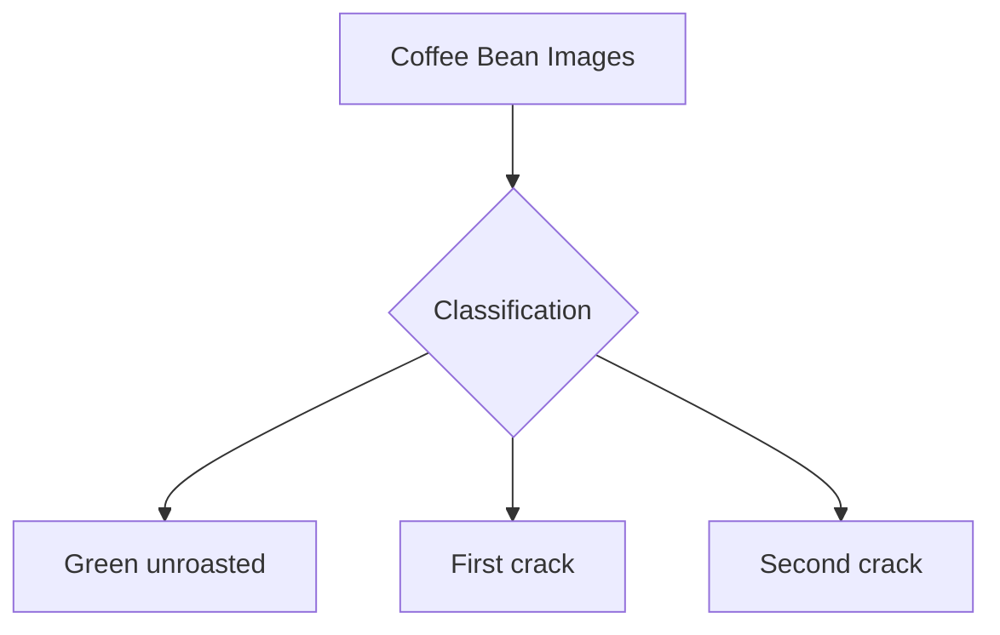
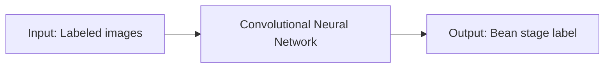
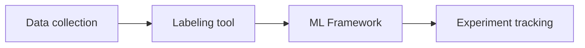
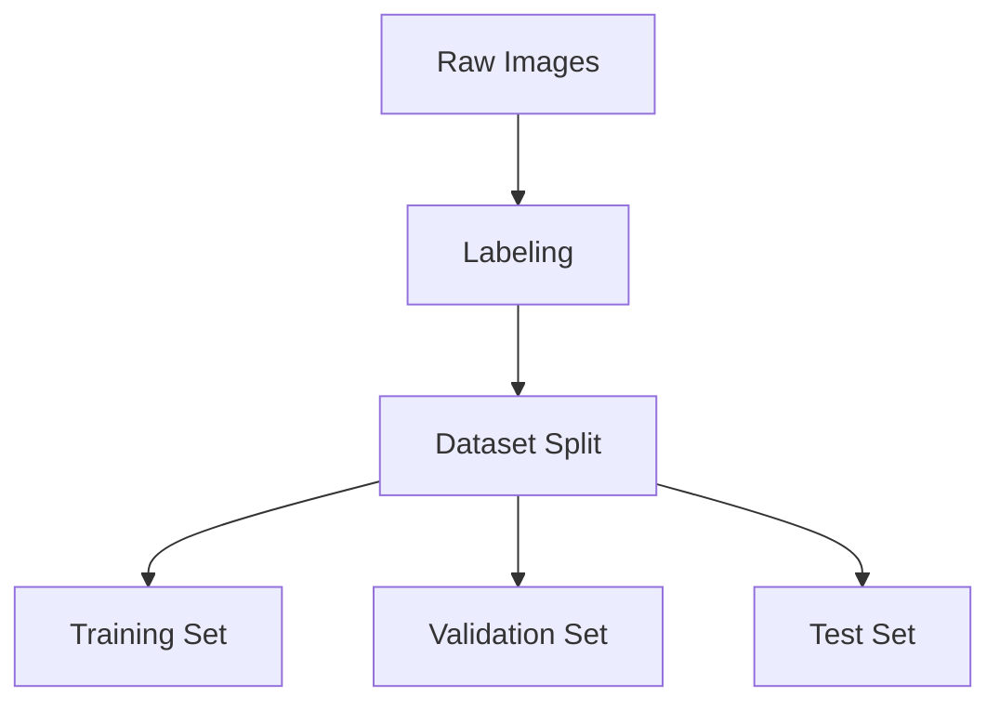
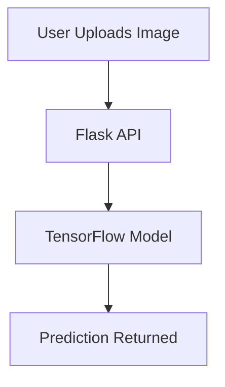

# Differentiating Coffee bean stages with Machine Learning

---
## Slide 1: Introduction
- Title: Differentiating Coffee bean stages with Machine Learning
- Subtitle: Tinkleman coffee importer & franchise

---
## Slide 2: The problem
- We need to classify images of coffee beans into:
  - Green unroasted
  - First crack
  - Second crack



---
## Slide 3: Type of Machine Learning required
- Supervised learning
- Image classification using Convolutional Neural Networks (CNNs)



---
## Slide 4: Tooling for implementation
- Frameworks:
  - TensorFlow (Keras)
  - PyTorch
- Data labeling:
  - LabelImg, Roboflow, CVAT
- Experiment tracking:
  - MLflow, TensorBoard, Weights & Biases



---
## Slide 5: Providing training & validation data
- Collect diverse, labeled images for each bean stage
- Split data: Train (70%), Validation (15%), Test (15%)
- Use data augmentation for robustness



---
## Slide 6: Summary & next steps
- Use CNNs for image classification
- Leverage modern ML frameworks and data tools
- Prepare a robust, labeled dataset

---
## Extra teacher credit: TensorFlow, Flask, and Docker

### Slide 7: Saving a TensorFlow model
- After training, save the model weights:

```python
# Save model weights
model.save('coffee_bean_model')
```

---
### Slide 8: Serving the model with Flask
- Create a Flask API to load and serve the model:

```python
from flask import Flask, request, jsonify
import tensorflow as tf
from PIL import Image
import numpy as np

app = Flask(__name__)
model = tf.keras.models.load_model('coffee_bean_model')

@app.route('/predict', methods=['POST'])
def predict():
    file = request.files['file']
    img = Image.open(file.stream).resize((224, 224))
    img_array = np.array(img) / 255.0
    img_array = np.expand_dims(img_array, axis=0)
    prediction = model.predict(img_array)
    class_idx = np.argmax(prediction, axis=1)[0]
    classes = ['Green Unroasted', 'First Crack', 'Second Crack']
    return jsonify({'class': classes[class_idx]})

if __name__ == '__main__':
    app.run(host='0.0.0.0', port=5000)
```

---
### Slide 9: Dockerizing the Flask App
- Example Dockerfile:

```dockerfile
FROM python:3.10-slim
WORKDIR /app
COPY . /app
RUN pip install flask tensorflow pillow numpy
EXPOSE 5000
CMD ["python", "app.py"]
```

---
### Slide 10: Workflow diagram



---
### Slide 11: Summary
- Train and save model with TensorFlow
- Serve predictions with Flask
- Deploy as a Docker container for portability

---
