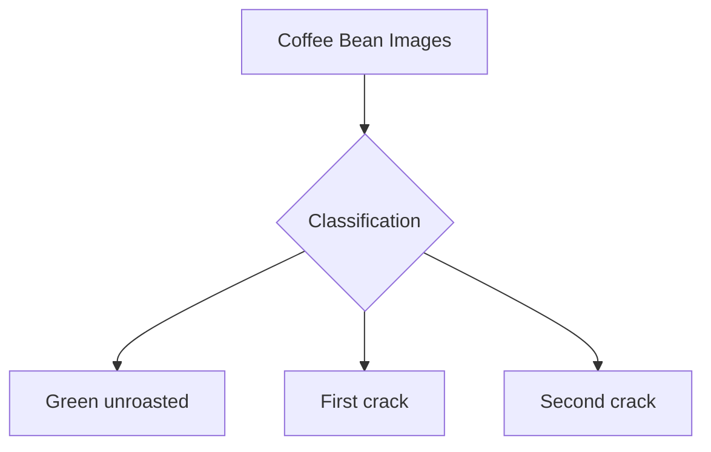
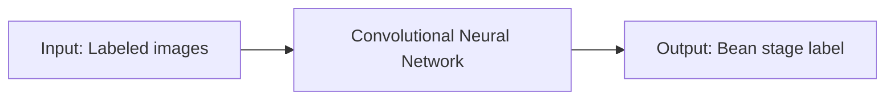
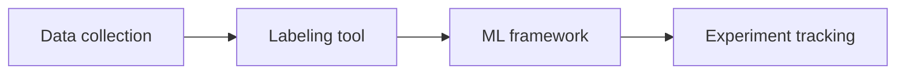
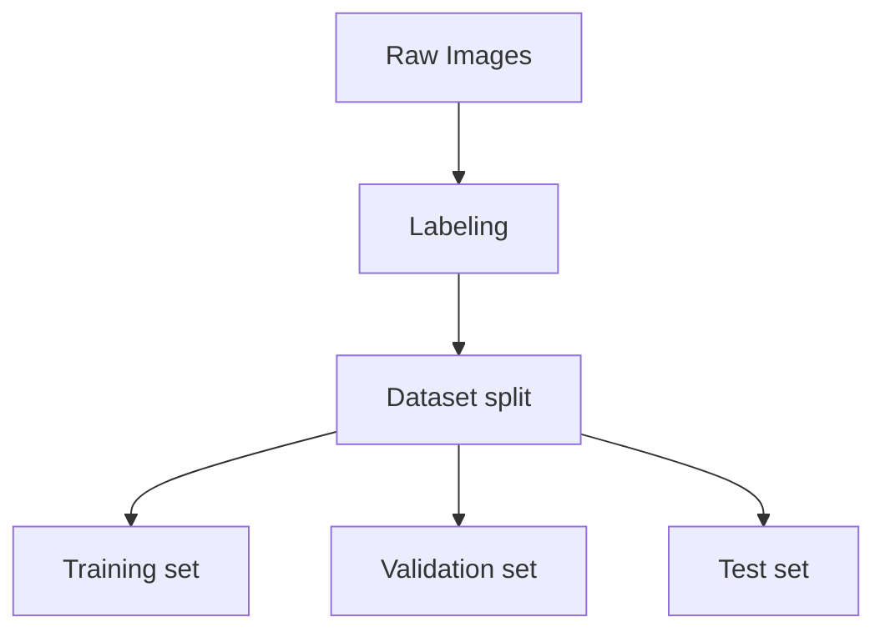
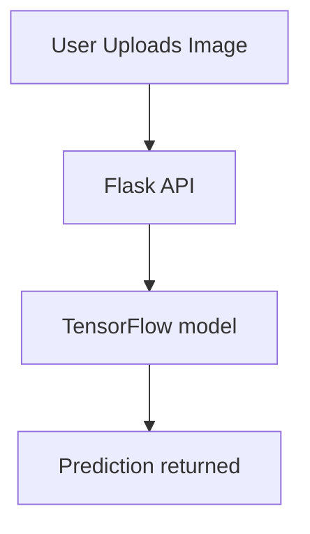

# Differentiating Coffee bean stages with Machine Learning

---
## Slide 1: Introduction
- Title: Differentiating Coffee bean stages with Machine Learning
- Subtitle: Tinkleman coffee importer & franchise

<!-- Speaker notes: 
Why: Start by welcoming the audience and introducing the topic. Explain that coffee beans go through different stages during roasting, and identifying these stages is important for making good coffee. Many companies do this by hand, but it can be slow and inconsistent. Machine learning is a way for computers to learn from examples and help automate this process, making it faster and more reliable.
How: Tell the audience that you will show how machine learning can be used to look at pictures of coffee beans and decide what stage they are in. Mention that this can help the company make better coffee and save time. Let them know you will explain each step, even if they have never worked with machine learning before.
Extra: We use machine learning because it can look at lots of pictures very quickly and doesn't get tired or distracted like people do. For example, if you had to sort hundreds of photos of beans, you might make mistakes after a while, but a computer can keep going and be consistent every time. This helps make sure every cup of coffee tastes the way it should.
-->

---
## Slide 2: The problem
- We need to classify images of coffee beans into:
  - Green unroasted
  - First crack
  - Second crack



<!-- Speaker notes: 
Why: Explain that the main challenge is to look at a photo of coffee beans and figure out which stage they are in. Each stage changes the flavor and quality of the coffee. Doing this by eye can be hard, especially when you have a lot of beans to check.
How: Show the diagram and point out that we want to sort beans into three groups: green (not roasted), first crack (partially roasted), and second crack (more roasted). Explain that the differences can be subtle, so we need a smart system to help.
Extra: We use images because it's much easier and faster to take a photo than to check each bean by hand. For example, imagine a conveyor belt with beans passing by—a camera can snap pictures and the computer can sort them instantly. This saves time and helps avoid mistakes that can happen if someone is tired or in a hurry.
-->

---
## Slide 3: Type of Machine Learning required
- Supervised learning
- Image classification using Convolutional Neural Networks (CNNs)



<!-- Speaker notes: 
Why: Introduce the idea of machine learning. Supervised learning means we show the computer lots of examples where we already know the answer, so it can learn to recognize patterns.
How: Explain that we use a special kind of computer program called a Convolutional Neural Network (CNN) that is very good at looking at pictures. We give it many images of beans, each labeled with the correct stage, and it learns to tell them apart. The diagram shows how labeled images go in, and the model learns to give the right label as output.
Extra: We use supervised learning because it's like teaching a child with flashcards—"this is green, this is first crack, this is second crack." The CNN is chosen because it's like giving the computer special glasses that help it see shapes and colors in pictures. For example, if you show it enough photos of green beans, it learns what makes them different from roasted ones.
-->

---
## Slide 4: Tooling for implementation
- Frameworks:
  - TensorFlow (Keras)
  - PyTorch
- Data labeling:
  - LabelImg, Roboflow, CVAT
- Experiment tracking:
  - MLflow, TensorBoard, Weights & Biases



<!-- Speaker notes: 
Why: Using the right tools makes the process easier and more organized. Each tool has a specific job in the machine learning workflow.
How: Explain that we first collect images of beans. Then, we use labeling tools to mark which stage each bean is in—this is like putting a sticker on each photo saying "green" or "first crack." Next, we use frameworks like TensorFlow or PyTorch to build and train our model. Finally, experiment tracking tools help us keep notes on what we tried and how well it worked, so we can improve over time.
Extra: We pick TensorFlow or PyTorch because they are like toolkits with lots of ready-made parts for building models, so we don't have to start from scratch. LabelImg, Roboflow, and CVAT are like digital highlighters for marking what's in each photo. MLflow, TensorBoard, and Weights & Biases are like science notebooks—they help us remember what settings we used and which ones worked best. For example, if we try two different models, these tools help us see which one was more accurate.
-->

---
## Slide 5: Providing training & validation data
- Collect diverse, labeled images for each bean stage
- Split data: Train (70%), Validation (15%), Test (15%)
- Use data augmentation for robustness



<!-- Speaker notes: 
Why: The computer needs to see lots of different examples to learn well. If we only show it one kind of bean or lighting, it won't work in real life. Splitting the data helps us check if the computer is really learning or just memorizing.
How: Collect as many photos as possible, showing beans in different lighting, angles, and backgrounds. Label each photo with the correct stage. Split the photos into three groups: one for teaching the computer (training), one for checking its progress as it learns (validation), and one for testing it at the end (test). Data augmentation means making small changes to the photos—like flipping or brightening them—so the computer learns to handle variety.
Extra: We split the data so the computer doesn't just "cheat" by memorizing the answers. For example, if you only ever see one kind of green bean, you might think all green beans look the same, but in real life, they can look different. Data augmentation is like showing the computer the same bean but with sunglasses, a hat, or in a different room—so it learns to recognize beans no matter what.
-->

---
## Slide 6: Model Architecture & Training
- Choose a Convolutional Neural Network (CNN) suitable for image classification
- Example architecture: Input layer → Conv2D layers → MaxPooling → Flatten → Dense layers → Output layer
- Compile the model with appropriate loss and optimizer (e.g., categorical_crossentropy, Adam)
- Train the model using the training set, validate on the validation set

```python
import tensorflow as tf
from tensorflow.keras import layers, models

model = models.Sequential([
    layers.Input(shape=(224, 224, 3)),
    layers.Conv2D(32, (3, 3), activation='relu'),
    layers.MaxPooling2D((2, 2)),
    layers.Conv2D(64, (3, 3), activation='relu'),
    layers.MaxPooling2D((2, 2)),
    layers.Flatten(),
    layers.Dense(64, activation='relu'),
    layers.Dense(3, activation='softmax')
])
model.compile(optimizer='adam', loss='categorical_crossentropy', metrics=['accuracy'])
```

<!-- Speaker notes: 
Why: The structure of the model decides what it can learn. Training and validation help us make sure it learns the right things and doesn't just memorize the examples.
How: Explain that the model is like a series of filters that look for patterns in the images—edges, colors, shapes. The Conv2D layers are like looking for small details, MaxPooling picks out the most important parts, Flatten turns everything into a list, and Dense layers make the final decision. We use special settings (loss and optimizer) to help the computer learn. We train the model by showing it the training images and checking how well it does on the validation images, adjusting as needed.
Extra: We use a CNN because it's like giving the computer a magnifying glass to spot tiny differences in pictures. For example, the Conv2D layer is like looking for lines or spots, MaxPooling is like zooming out to see the big picture, and Dense layers are like making the final guess. We use 'adam' as the optimizer because it's good at helping the computer learn quickly, and 'categorical_crossentropy' because we have more than two categories (green, first crack, second crack). Training and validation are like practicing for a test and then checking your answers with a friend before the real exam.
-->

---
### Slide 7: Saving a TensorFlow model
- After training, save the model weights:

```python
# Save model weights
model.save('coffee_bean_model')
```

<!-- Speaker notes: 
Why: Once the computer has learned, we want to save its knowledge so we can use it later without retraining.
How: Use the save function to store the model in a file. This file keeps all the information the computer learned, so we can load it up and use it to make predictions on new images, even on a different computer.
Extra: Saving the model is like saving your progress in a video game. You don't want to start over every time! For example, after training, we save the model so we can use it in a café or on another computer without having to teach it all over again.
-->

---
### Slide 8: Serving the model with Flask
- Create a Flask API to load and serve the model:

```python
from flask import Flask, request, jsonify
import tensorflow as tf
from PIL import Image
import numpy as np

app = Flask(__name__)
model = tf.keras.models.load_model('coffee_bean_model')

@app.route('/predict', methods=['POST'])
def predict():
    file = request.files['file']
    img = Image.open(file.stream).resize((224, 224))
    img_array = np.array(img) / 255.0
    img_array = np.expand_dims(img_array, axis=0)
    prediction = model.predict(img_array)
    class_idx = np.argmax(prediction, axis=1)[0]
    classes = ['Green Unroasted', 'First Crack', 'Second Crack']
    return jsonify({'class': classes[class_idx]})

if __name__ == '__main__':
    app.run(host='0.0.0.0', port=5000)
```

<!-- Speaker notes: 
Why: We want to make it easy for anyone to use the model, even if they don't know how it works. A web API lets other programs send a photo and get a prediction back.
How: Flask is a simple tool for making web apps. We write a small program that loads the saved model, waits for someone to send a photo, prepares the photo so the model can understand it, asks the model for a prediction, and sends the answer back. This way, anyone can use the model by sending a photo to the web address.
Extra: We use Flask because it's like building a small post office for our model—people can send in a photo (like mailing a letter), and the model sends back the answer (like getting a reply). For example, a café owner could use their phone to take a picture of beans, send it to the app, and get an instant answer about the roasting stage.
-->

---
### Slide 9: Dockerizing the Flask App
- Example Dockerfile:

```dockerfile
FROM python:3.10-slim
WORKDIR /app
COPY . /app
RUN pip install flask tensorflow pillow numpy
EXPOSE 5000
CMD ["python", "app.py"]
```

<!-- Speaker notes: 
Why: Computers can be set up in many different ways, which can cause problems when moving programs from one place to another. Docker makes sure everything needed to run the app is included, so it works the same everywhere.
How: The Dockerfile is like a recipe. It tells the computer to start with a basic version of Python, add our code, install the tools we need, and open the right door (port) so people can use the app. We can then send this package to any computer or cloud service, and it will run just like on our own machine.
Extra: We use Docker because it's like putting our app in a lunchbox—everything it needs is packed inside, so it doesn't matter where you take it, it will always work. For example, if you want to run the app on your laptop or in the cloud, Docker makes sure it works the same way every time, with no missing pieces.
-->

---
### Slide 10: Workflow diagram



<!-- Speaker notes: 
Why: Seeing the whole process in one picture helps everyone understand how the parts fit together.
How: Walk through the diagram step by step: a user takes a photo and uploads it, the Flask API receives it, the model looks at the photo and decides the stage, and the answer is sent back. This shows how everything connects, from the user to the final prediction.
Extra: The workflow is like an assembly line: the user is the person putting something on the belt (the photo), the Flask API is the worker who hands it to the expert (the model), and the expert gives the answer back. For example, a barista could snap a photo, send it to the app, and get a quick answer about the beans—all in a few seconds.
-->

---
### Slide 11: Summary
- Train and save model with TensorFlow
- Serve predictions with Flask
- Deploy as a Docker container for portability

<!-- Speaker notes: 
Why: It's important to review what we've learned and see the big picture.
How: Go over the main steps: collecting and labeling data, building and training the model, saving it, making it available through a web API, and packaging it with Docker. Emphasize that this approach can be used for many other problems where we want computers to recognize things in images. Encourage questions and curiosity.
Extra: We use this workflow because it makes the whole process simple and repeatable. For example, you could use the same steps to teach a computer to recognize ripe fruit, sort recycling, or spot defects in products. The tools and steps we chose help make sure anyone can use the system, anywhere, without needing to be a machine learning expert.
-->

---
