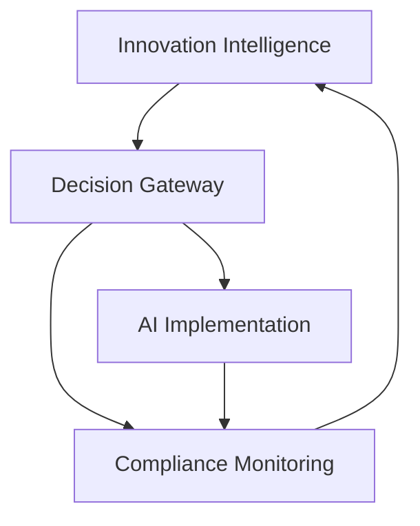

````markdown
# AI Center of Excellence Governance & ROI Framework - Solution

## Executive Summary

**Presentation Title:** "AI CoE Governance: Keeping Teams Aligned with Innovation"  
**Duration:** 30 minutes  
**Audience:** Data Science and AppDev teams  
**Date:** July 13, 2025

**Key Focus:** Establishing processes for cross-team AI innovation alignment and ROI justification frameworks for Tinkleman Coffee's unique business needs.

---

## Slide 1: AI CoE Governance for Coffee Innovation

**Title:** "AI Center of Excellence: Aligning Teams for Coffee Innovation"

**Subtitle:** Tinkleman Coffee Company - Chief Architect Presentation

**Audience:** Data Science and AppDev Teams  
**Date:** July 13, 2025

**Context:** The CEO has asked for immediate clarity on how our AI CoE will keep technical, legal, and compliance teams synchronized with AI innovations while ensuring ROI-driven use cases.

---

## Slide 2: The Critical Challenge We Face

**Title:** "Why Cross-Team AI Alignment is Mission-Critical"

**The Problem:**
- **AI Innovation Velocity**: New tools emerge weekly (GPT models, computer vision, edge AI)
- **Regulatory Complexity**: EU AI Act, GDPR, food safety compliance
- **Business Impact**: AI decisions affect quality, supply chain, customer experience
- **Team Silos**: Technical, legal, and compliance teams work in isolation

**Coffee-Specific Challenges:**
- Quality control AI must meet food safety standards
- Supply chain AI handles sensitive supplier data
- Customer AI must comply with personalization regulations
- Operational AI affects worker safety and efficiency

---

## Slide 3: AI CoE Governance Framework - Keeping Teams Aligned

**Title:** "Three-Pillar Process for Cross-Team Innovation Alignment"

### Pillar 1: Innovation Intelligence System
**Purpose:** Ensure all teams know about relevant AI developments
- **Weekly AI Radar**: Curated updates on coffee-relevant AI innovations
- **Monthly Technology Impact Assessment**: Legal and compliance review of new tools
- **Quarterly Innovation Summits**: Cross-team deep dives on emerging technologies

### Pillar 2: Cross-Functional Decision Gateway
**Purpose:** Structured evaluation before AI adoption
- **Technical Feasibility Review**: Data Science and AppDev assessment
- **Legal Risk Assessment**: Compliance team evaluation
- **Business Impact Analysis**: ROI and strategic alignment validation

### Pillar 3: Continuous Compliance Monitoring
**Purpose:** Ongoing oversight of AI implementations
- **Real-time Compliance Dashboards**: Monitor AI system performance against regulations
- **Monthly Compliance Reviews**: Legal team assessment of deployed AI systems
- **Quarterly Regulatory Update Sessions**: Keep teams informed of changing requirements



---

## Slide 4: Team-Specific AI Use Case Development

**Title:** "How Each Team Should Approach AI Use Cases"

### Data Science Team Focus Areas
**High-Impact Use Cases:**
- **Predictive Quality Control**: Bean grading, roast optimization, defect detection
- **Supply Chain Intelligence**: Demand forecasting, inventory optimization, risk prediction
- **Customer Analytics**: Preference modeling, churn prediction, lifetime value

**ROI Justification Approach:**
- **Baseline Metrics**: Current accuracy rates, processing times, costs
- **Improvement Targets**: Specific percentage improvements (e.g., 15% reduction in defects)
- **Financial Impact**: Cost savings, revenue increases, risk mitigation value

### AppDev Team Focus Areas
**High-Impact Use Cases:**
- **Customer Experience**: Personalized recommendations, intelligent chatbots, voice ordering
- **Operational Automation**: Inventory management, scheduling optimization, workflow automation
- **Decision Support**: Real-time analytics dashboards, predictive maintenance alerts

**ROI Justification Approach:**
- **User Engagement**: Session duration, conversion rates, customer satisfaction scores
- **Operational Efficiency**: Reduced manual tasks, faster response times, improved accuracy
- **Development Velocity**: Faster feature delivery, reduced maintenance costs

---

## Slide 5: Coffee-Specific ROI Justification Framework

**Title:** "Building Business Cases for AI in Coffee Operations"

### Financial Impact Metrics
**Revenue Generation:**
- **Personalization ROI**: 8-12% increase in customer lifetime value
- **Quality Optimization**: 5-8% reduction in waste and returns
- **Supply Chain Efficiency**: 3-5% reduction in procurement costs

**Cost Reduction:**
- **Automation Savings**: 20-30% reduction in manual processing time
- **Predictive Maintenance**: 15-25% reduction in equipment downtime
- **Quality Control**: 10-15% reduction in defect-related costs

### Operational Excellence Metrics
**Quality Improvements:**
- **Consistency Scores**: Target 95%+ consistency across all locations
- **Customer Satisfaction**: Net Promoter Score improvements
- **Defect Reduction**: Measurable decrease in quality issues

**Efficiency Gains:**
- **Processing Speed**: Time reduction in key operations
- **Decision Speed**: Faster response to market changes
- **Scalability**: Ability to handle growth without proportional cost increases

### Strategic Value Metrics
**Market Position:**
- **Innovation Leadership**: First-mover advantage in AI adoption
- **Customer Loyalty**: Enhanced experience driving retention
- **Sustainability**: Environmental impact reduction through optimization

---

## Slide 6: Implementation Process & Team Coordination

**Title:** "Coordinated Implementation Strategy"

### Phase 1: Foundation Building (Months 1-2)
**All Teams:**
- **Governance Setup**: Establish AI CoE committee with representatives from all teams
- **Skills Assessment**: Identify training needs and capability gaps
- **Baseline Metrics**: Establish current performance benchmarks

**Data Science Focus:**
- **Data Pipeline Architecture**: Establish secure, compliant data flows
- **Model Development Environment**: Set up ML development and testing frameworks

**AppDev Focus:**
- **AI Integration Framework**: Create APIs and integration standards
- **Security Architecture**: Implement AI-specific security measures

### Phase 2: Pilot Implementation (Months 3-4)
**Coordinated Pilots:**
- **Quality Control AI**: Computer vision for bean grading (Data Science lead)
- **Customer Recommendation Engine**: Personalized ordering (AppDev lead)
- **Joint Monitoring**: Real-time compliance and performance tracking

### Phase 3: Scale & Optimize (Months 5-6)
**Expansion Strategy:**
- **Supply Chain Optimization**: Predictive analytics for inventory
- **Customer Experience Enhancement**: Advanced personalization features
- **Operational Intelligence**: Comprehensive analytics dashboard

---

## Slide 7: Communication & Knowledge Management

**Title:** "Keeping Everyone Informed and Aligned"

### Regular Communication Rhythms
**Weekly Updates:**
- **AI Innovation Digest**: 5-minute read on relevant developments
- **Implementation Status**: Progress updates on active projects
- **Compliance Alerts**: Immediate notifications of regulatory changes

**Monthly Deep Dives:**
- **Technology Spotlight**: Detailed exploration of new AI tools
- **Case Study Reviews**: Analysis of successful implementations
- **Lessons Learned**: Sharing failures and improvements

**Quarterly Strategic Sessions:**
- **Innovation Pipeline Review**: Evaluate upcoming opportunities
- **ROI Assessment**: Measure performance against targets
- **Regulatory Update**: Comprehensive compliance review

### Knowledge Management System
**Centralized Repository:**
- **Best Practices Library**: Tested approaches and templates
- **Compliance Guidelines**: Legal and regulatory requirements
- **Coffee-Specific Use Cases**: Industry-relevant examples and benchmarks

---

## Slide 8: Success Metrics & Measurement

**Title:** "How We'll Measure AI CoE Success"

### Process Success Indicators
**Cross-Team Alignment:**
- **Communication Effectiveness**: Survey scores on information sharing
- **Decision Speed**: Time from idea to implementation approval
- **Compliance Adherence**: Zero regulatory violations or issues

**Innovation Adoption:**
- **Technology Uptake**: Rate of new AI tool evaluation and adoption
- **Cross-Team Collaboration**: Number of joint projects and initiatives
- **Knowledge Sharing**: Usage of knowledge management system

### Business Impact Metrics
**Financial Performance:**
- **ROI Achievement**: Meet or exceed projected returns
- **Cost Reduction**: Documented savings from AI implementations
- **Revenue Growth**: Measurable business impact from AI initiatives

**Operational Excellence:**
- **Quality Improvements**: Consistency, defect reduction, customer satisfaction
- **Efficiency Gains**: Processing speed, automation success, scalability
- **Market Position**: Innovation leadership, competitive advantage

### Implementation Timeline
**30-Day Targets:**
- Form AI CoE steering committee
- Complete skills assessment
- Define baseline metrics

**90-Day Targets:**
- Launch first pilot projects
- Implement governance framework
- Achieve initial ROI indicators

**180-Day Targets:**
- Scale successful pilots
- Demonstrate measurable business impact
- Establish industry leadership position

---

## Slide 9: Call to Action

**Title:** "Next Steps for AI CoE Success"

**Immediate Actions (This Week):**
1. **Commit to Governance Framework**: Approve the three-pillar process
2. **Form Steering Committee**: Designate representatives from each team
3. **Prioritize Use Cases**: Select initial pilots for maximum impact

**30-Day Implementation:**
1. **Launch Communication Rhythms**: Begin weekly updates and monthly deep dives
2. **Establish Baseline Metrics**: Document current performance benchmarks
3. **Set Up Knowledge Management**: Create centralized repository and guidelines

**Success Formula:**
```
AI CoE Success = (Innovation Alignment + Cross-Team Communication + ROI Focus) × Coffee Business Context
```

**Key Takeaways:**
- **Governance enables innovation** rather than restricting it
- **Regular communication** keeps all teams aligned with AI advances
- **Coffee-specific ROI frameworks** ensure business value delivery
- **Phased implementation** reduces risk while building capabilities

---

## Presentation Timing Guide

**30-Minute Structure:**
- **Slide 1**: Title & Context (2 minutes)
- **Slide 2**: The Challenge (4 minutes)
- **Slide 3**: Governance Framework (6 minutes)
- **Slide 4**: Team-Specific Use Cases (5 minutes)
- **Slide 5**: ROI Framework (5 minutes)
- **Slide 6**: Implementation Process (4 minutes)
- **Slide 7**: Communication Strategy (2 minutes)
- **Slide 8**: Success Metrics (1 minute)
- **Slide 9**: Call to Action (1 minute)

**Key Success Factors:**
- Focus on practical, actionable processes
- Emphasize coffee industry specifics
- Demonstrate clear ROI pathways
- Ensure cross-team collaboration
- Maintain compliance focus throughout

````
