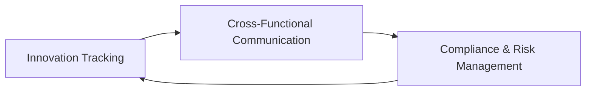

# AI Center of Excellence Governance & ROI Framework - Solution

## Executive Summary

**Presentation Title:** "AI CoE Governance: Keeping Teams Aligned with Innovation"  
**Duration:** 30 minutes  
**Audience:** Data Science and AppDev teams  
**Date:** July 13, 2025

---

## Slide 1: AI CoE Governance: Keeping Teams Aligned with Innovation

**Title:** "AI Center of Excellence: Driving Innovation Through Governance"

**Subtitle:** Tinkleman Coffee Company - Chief Architect Presentation

**Audience:** Data Science and AppDev Teams

**Date:** July 13, 2025

---

## Slide 2: The Challenge - Keeping Pace with AI Innovation

**Title:** "AI Innovation Landscape in Coffee Operations"

**Content:**
- **Supply Chain AI**: Predictive analytics for crop yields, weather modeling
- **Quality Control**: Computer vision for bean grading, roast optimization
- **Customer Experience**: Personalized recommendations, demand forecasting
- **Operational Efficiency**: Inventory optimization, energy management

**Key Challenge:** How do we keep technical, legal, and compliance teams aligned with rapidly evolving AI innovations?

**Speaker Notes:**
- Highlight how rapidly AI is evolving in our industry
- Emphasize competitive advantage of staying current
- Connect to Tinkleman's specific challenges: global supply chain, quality consistency

---

## Slide 3: AI CoE Governance Framework - Core Processes

**Title:** "Essential Processes for Cross-Team Alignment"

### Process 1: Innovation Tracking & Assessment
- **Monthly Technology Scans**: Identify emerging AI tools relevant to coffee operations
- **Quarterly Impact Assessments**: Evaluate new technologies against business objectives

### Process 2: Cross-Functional Communication
- **Weekly AI Updates**: Brief technical summaries for all teams
- **Monthly Deep Dives**: Detailed technical sessions for implementation teams
- **Quarterly Business Reviews**: ROI analysis and strategic alignment sessions

### Process 3: Compliance & Risk Management
- **Continuous Monitoring**: AI bias detection, data privacy compliance
- **Regular Audits**: Third-party assessments of AI systems



**Speaker Notes:**
- Emphasize that these processes create a feedback loop
- Highlight importance of regular cadence for staying current
- Connect to coffee business: quality, consistency, trust

---

## Slide 4: Team-Specific AI Use Case Framework

**Title:** "AI Use Case Development by Team Function"

### Data Science Teams
**Focus Areas:**
- Predictive modeling for demand forecasting
- Quality control automation
- Supply chain optimization

**ROI Justification Approach:**
- Quantify accuracy improvements (% reduction in forecast error)
- Measure operational efficiency gains (time saved, cost reduction)
- Calculate quality impact (defect reduction, customer satisfaction)

### AppDev Teams
**Focus Areas:**
- AI-powered customer experiences
- Intelligent automation workflows
- Real-time decision support systems

**ROI Justification Approach:**
- User engagement metrics (session duration, conversion rates)
- Development efficiency (reduced manual coding, faster deployments)
- System performance improvements (response times, uptime)

**Speaker Notes:**
- Tailor examples to each team's expertise and priorities
- Emphasize collaboration between teams for maximum impact
- Highlight how both teams contribute to overall business success

---

## Slide 5: ROI Justification Framework for Coffee Operations

**Title:** "Business Case Development: Coffee-Specific ROI Metrics"

### Financial Metrics
- **Revenue Impact**: Increased sales through personalization, improved customer retention
- **Cost Reduction**: Operational efficiency, reduced waste, optimized inventory
- **Risk Mitigation**: Quality control, supply chain resilience, compliance costs

### Operational Metrics
- **Quality Improvements**: Consistency scores, defect rates, customer satisfaction
- **Efficiency Gains**: Processing time, manual task reduction, decision speed
- **Scalability**: Ability to handle growth without proportional cost increases

### Strategic Metrics
- **Market Position**: Competitive advantage, innovation leadership
- **Customer Experience**: Net Promoter Score, retention rates, engagement
- **Sustainability**: Environmental impact, ethical sourcing, waste reduction

**Speaker Notes:**
- Connect each metric to specific coffee business outcomes
- Emphasize importance of measuring both tangible and intangible benefits
- Highlight how AI investments compound over time

---

## Slide 6: Implementation Roadmap & Team Coordination

**Title:** "Coordinated Implementation Strategy"

### Phase 1: Foundation (Months 1-3)
- **Data Science**: Establish data pipelines, baseline models
- **AppDev**: Create AI integration frameworks, API standards
- **Joint**: Define success metrics, testing protocols

### Phase 2: Pilot Programs (Months 4-6)
- **Data Science**: Deploy predictive models for demand forecasting
- **AppDev**: Implement customer recommendation engine
- **Joint**: Monitor performance, gather user feedback

### Phase 3: Scale & Optimize (Months 7-12)
- **Data Science**: Expand to supply chain optimization, quality control
- **AppDev**: Enhance user interfaces, add new AI features
- **Joint**: Continuous improvement, advanced analytics

**Success Metrics:**
- Technical: Model accuracy, system performance, integration success
- Business: ROI achievement, user adoption, operational improvements
- Governance: Compliance adherence, risk mitigation, team satisfaction

**Speaker Notes:**
- Emphasize collaborative nature of implementation
- Highlight importance of starting with clear foundations
- Connect to coffee business cycles and seasonal considerations

---

## Slide 7: Communication & Knowledge Sharing Strategy

**Title:** "Keeping Everyone Informed and Aligned"

### Regular Communication Channels
- **AI Innovation Newsletter**: Monthly updates on industry trends, internal progress
- **Technical Lunch & Learns**: Bi-weekly sessions on new tools, techniques
- **Cross-Team Standups**: Weekly alignment meetings during active projects

### Knowledge Management
- **AI Knowledge Base**: Centralized repository of best practices, lessons learned
- **Innovation Pipeline**: Transparent tracking of AI initiatives and status
- **Success Stories**: Case studies highlighting ROI achievements and lessons

### External Engagement
- **Industry Conferences**: Team participation in AI and coffee industry events
- **Vendor Partnerships**: Regular meetings with AI solution providers
- **Academic Collaborations**: Research partnerships for emerging technologies

**Speaker Notes:**
- Emphasize importance of two-way communication
- Highlight value of learning from both successes and failures
- Connect to coffee industry networks and communities

---

## Slide 8: Next Steps & Implementation Timeline

**Title:** "Moving Forward Together"

### Immediate Actions (Next 30 Days)
1. **Form AI CoE Steering Committee**: Include representatives from all teams
2. **Conduct Skills Assessment**: Identify training needs and capability gaps
3. **Define Success Metrics**: Establish baseline measurements and targets
4. **Prioritize Use Cases**: Select initial pilot projects for maximum impact

### Medium-Term Goals (Next 90 Days)
1. **Implement Governance Framework**: Establish processes and communication channels
2. **Launch Pilot Projects**: Begin with highest-ROI, lowest-risk initiatives
3. **Develop Knowledge Base**: Create centralized resources and best practices

### Long-Term Vision (Next 12 Months)
1. **Scale Successful Pilots**: Expand proven use cases across coffee operations
2. **Achieve ROI Targets**: Demonstrate measurable business impact
3. **Become Industry Leader**: Position Tinkleman Coffee as AI innovation leader

**Speaker Notes:**
- Emphasize collaborative approach to implementation
- Highlight importance of starting with clear, achievable goals
- Connect to long-term vision of AI-driven coffee excellence

---

## Slide 9: Conclusion

**Title:** "AI CoE Success Through Collaborative Governance"

**Key Takeaways:**
- **Governance enables innovation** rather than restricting it
- **Regular communication cycles** keep all teams aligned with AI advances
- **Team-specific ROI frameworks** ensure business value delivery
- **Phased implementation** reduces risk while building capabilities

**Success Formula:**
```
AI CoE Success = (Innovation Tracking + Cross-Team Communication + Compliance Management) × ROI Focus
```

**Call to Action:** 
Form steering committee within 30 days, begin pilot projects within 90 days, achieve industry leadership within 12 months.

**Speaker Notes:**
- Emphasize that AI CoE is about enabling responsible innovation
- Highlight the importance of collaboration between data science and AppDev teams
- Connect back to Tinkleman Coffee's mission of quality and customer satisfaction
- End with confidence in the team's ability to execute this vision

---

## Implementation Summary

### 30-Minute Presentation Structure
- **Slide 1**: Title (1 minute)
- **Slide 2**: The Challenge (3 minutes)
- **Slide 3**: Governance Framework (5 minutes)
- **Slide 4**: Team-Specific Use Cases (5 minutes)
- **Slide 5**: ROI Framework (5 minutes)
- **Slide 6**: Implementation Roadmap (4 minutes)
- **Slide 7**: Communication Strategy (3 minutes)
- **Slide 8**: Next Steps (3 minutes)
- **Slide 9**: Conclusion (1 minute)

This streamlined presentation focuses on the two key requirements: processes for keeping teams aligned with AI innovation and ROI justification frameworks for different teams within Tinkleman Coffee's business context.
