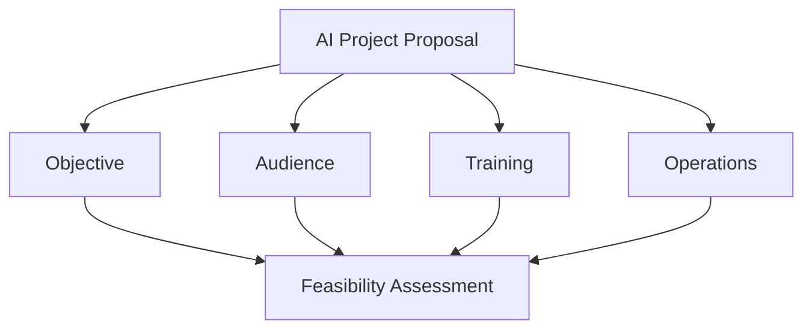
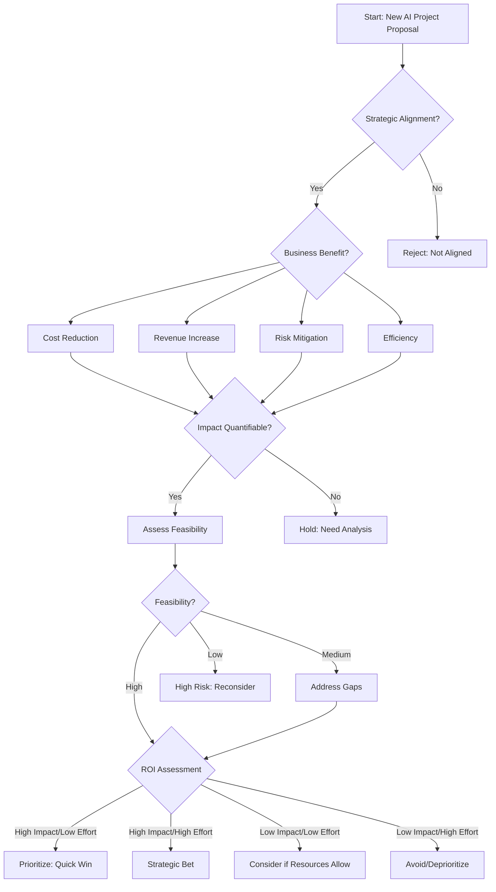
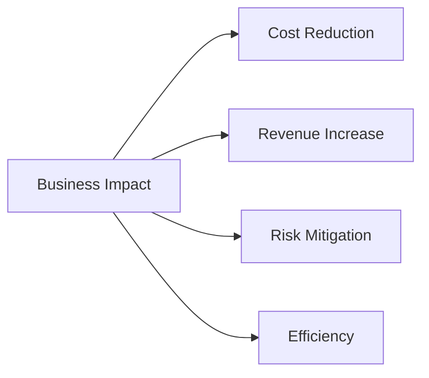
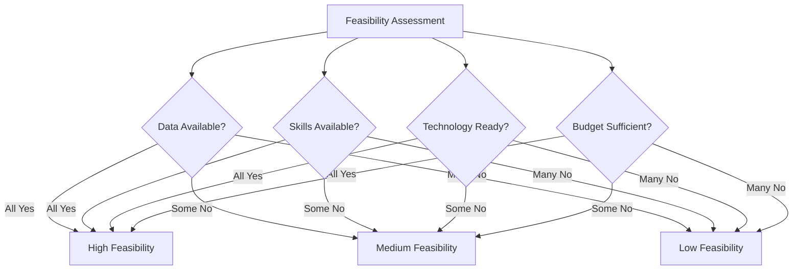

# AI Project ROI Decision Tree

---
## Slide 1: Introduction & Learning Objectives

- **Topic:** AI Project ROI Decision Tree for Coffee Companies
- **Context:** As the Chief Architect at a coffee company

**Learning Objectives:**
- Understand how to evaluate AI project proposals systematically
- Learn to apply the four key pillars of AI project assessment
- Create a decision framework for AI project prioritization
- Apply the framework to coffee industry use cases

<!-- Speaker notes: 
Why: Welcome the audience and introduce the topic. Explain that as companies explore AI opportunities, they need a systematic way to evaluate which projects are worth pursuing. This presentation offers a decision tree approach specifically tailored for the coffee industry, from importing to delivery.

How: Let the audience know you'll introduce a step-by-step framework for evaluating AI projects that considers strategic alignment, business impact, feasibility, and return on investment. The framework is designed to be accessible to non-technical stakeholders while providing actionable insights.

Extra: We're using a decision tree approach because it provides a clear, visual path for making complex decisions. For example, rather than getting overwhelmed by all the technical aspects of AI, this framework focuses on the business questions that matter most for your bottom line and strategic goals.
-->

---
## Slide 2: Key Concepts - The Four Pillars of AI Project Assessment

1. **Objective:** Define the problem and strategic alignment
2. **Audience:** Identify beneficiaries and impact scope
3. **Training:** Evaluate data needs and training costs
4. **Operations:** Estimate ongoing maintenance costs

<!-- Speaker notes: 
Why: Before diving into the decision tree, it's important to understand the four key pillars that form the foundation of AI project assessment. These pillars help evaluate whether a project is feasible and worthwhile from both technical and business perspectives.

How: Explain each pillar in simple terms: Objective is about what problem we're solving and why it matters to the company. Audience focuses on who benefits and how many customers or processes will be impacted. Training considers what data we need and how much it costs to prepare the AI. Operations looks at the ongoing costs of running the AI system day-to-day.

Extra: These four pillars help bridge the gap between technical feasibility and business value. For instance, an AI project might be technically possible, but if it doesn't align with your strategic objectives or reach a significant audience, it might not be worth the investment.
-->

---
## Slide 3: The Decision Tree Structure

<!-- Speaker notes: 
Why: The decision tree provides a systematic approach to evaluating AI projects, ensuring that only those with clear strategic alignment, sufficient impact, and reasonable feasibility move forward. This helps avoid wasting resources on projects unlikely to deliver value.

How: Walk through the decision flow step by step, explaining how it guides stakeholders through key questions: Does this align with our strategy? What business benefit does it provide? Can we quantify the impact? Is it feasible to implement? What's the balance of impact versus effort?

Extra: This structure forces discussion of the most important factors before technical implementation begins. For example, many organizations jump straight to technical feasibility without first confirming strategic alignment, which can lead to well-executed projects that don't actually move the business forward.
-->

---
## Slide 4: Strategic Alignment - First Decision Point

- **Key Question:** Does the proposed AI project directly align with our strategic objectives?
- **Examples for coffee company:**
  - Importing: Optimizing supplier selection, quality prediction
  - Roasting: Profile optimization, waste reduction
  - Distribution: Route optimization, inventory management
  - Delivery: Customer satisfaction, delivery timing

<!-- Speaker notes: 
Why: Strategic alignment is the first and most important filter. If a project doesn't support your company's strategic objectives, it doesn't matter how technically interesting or feasible it might be.

How: For each part of the coffee business, provide examples of what good alignment looks like. Emphasize that projects should connect directly to stated strategic goals, not just seem generally useful.

Extra: Consider asking stakeholders to articulate exactly which strategic objectives their AI project supports before proceeding. For instance, an AI project to optimize delivery routes should clearly support strategic goals like reducing delivery times, cutting fuel costs, or improving customer satisfaction through more predictable delivery windows.
-->

---
## Slide 5: Business Impact Assessment

- **Cost Reduction:** Optimizing delivery routes, reducing waste in roasting
- **Revenue Increase:** Personalized recommendations, quality improvements
- **Risk Mitigation:** Predicting supply disruptions, quality control
- **Efficiency Improvement:** Automating repetitive tasks, faster processing

<!-- Speaker notes: 
Why: Different types of business impact require different evaluation approaches. Understanding the primary benefit helps focus the quantification efforts.

How: For each type of impact, share examples relevant to the coffee business. Explain that while multiple benefits may exist, identifying the primary one helps prioritize.

Extra: When evaluating AI projects, you might find that they touch on multiple benefit categories. For example, an AI system that optimizes roasting might reduce costs (less energy used), increase revenue (better tasting coffee commands premium prices), mitigate risks (fewer bad batches), and improve efficiency (less manual monitoring needed). In such cases, focus on the most significant and directly measurable benefit.
-->

---
## Slide 6: Impact Quantification

- **For Cost Reduction:** Estimated annual savings (<$50k, $50k-$200k, >$200k)
- **For Revenue Increase:** Projected additional annual revenue
- **For Risk Mitigation:** Cost of risks avoided × probability
- **For Efficiency:** Time saved × hourly cost + opportunity value

<!-- Speaker notes: 
Why: Putting numbers to the expected benefits helps compare different projects objectively and ensures that the value justifies the investment.

How: Explain the different approaches to quantifying each type of impact. For cost reduction, it's straightforward—estimate the costs before and after. For revenue, project the additional sales or higher prices. For risk mitigation, multiply the cost of the risk by the probability it will occur. For efficiency, calculate the value of time saved plus new opportunities created.

Extra: Use ranges rather than precise figures when uncertainty is high. For example, instead of saying an AI project will save exactly $75,000, provide a range like $50,000-$100,000. This acknowledges uncertainty while still providing a basis for decision-making.
-->

---
## Slide 7: Feasibility Assessment

- **Data Availability:** Do we have the necessary data?
- **Skills and Expertise:** Do we have the right team?
- **Technology Readiness:** Do we have the right tools?
- **Time and Budget:** Do we have sufficient resources?

<!-- Speaker notes: 
Why: Even the most strategically aligned, high-impact project will fail if it's not feasible to implement. This step ensures you don't commit to projects your organization isn't equipped to deliver.

How: Review each aspect of feasibility, asking questions about data access and quality, team skills and availability, technology infrastructure, and budget constraints. Projects with gaps in these areas will require additional investment before they can succeed.

Extra: Data availability is often the most challenging aspect of AI projects. For instance, an AI system to predict optimal roasting times needs extensive historical data on roasting parameters and outcomes. If you've been roasting by feel and haven't been recording precise temperature curves, times, and quality assessments, you may need to spend months collecting data before the AI project can begin.
-->

---
## Slide 8: ROI Assessment Matrix

| | **Low Effort** | **High Effort** |
|---|---|---|
| **High Impact** | Quick Win (Prioritize) | Strategic Bet (Plan Carefully) |
| **Low Impact** | Opportunistic (If Resources Allow) | Avoid/Deprioritize |

<!-- Speaker notes: 
Why: The final decision comes down to balancing potential impact against the effort required. This matrix provides a simple framework for categorizing and prioritizing projects.

How: Explain each quadrant in the matrix. Quick wins (high impact, low effort) should be prioritized. Strategic bets (high impact, high effort) require careful planning but can be worthwhile. Opportunistic projects (low impact, low effort) can be pursued if resources are available. Projects in the avoid/deprioritize quadrant (low impact, high effort) generally aren't worth pursuing.

Extra: The definitions of "high" and "low" will vary by organization. For a small coffee roaster, a "high effort" project might cost $50,000, while for a major international chain, that might be considered "low effort." The important thing is to be consistent in how you categorize projects relative to each other.
-->

---
## Slide 9: Example - Coffee Roasting AI Project

**Applying the Four Pillars:**
1. **Objective:** Optimize roasting profiles for quality and reduced waste
2. **Audience:** 30% of customer base (high-end market)
3. **Training:** 2 months, $20,000 cost
4. **Operations:** $50 per day

**Assessment:**
- Strategic alignment: ✅ Aligns with product quality goals
- Business impact: Cost reduction and quality improvement
- Feasibility: High (data available, team skilled)
- ROI: High impact, low effort = Quick Win

<!-- Speaker notes: 
Why: Real examples help stakeholders understand how to apply the framework to actual projects. This coffee roasting example demonstrates the complete evaluation process.

How: Walk through how this specific AI project was evaluated using the four pillars and decision tree. Show how the assessment led to the conclusion that this is a "quick win" project worth prioritizing.

Extra: The coffee roasting AI example shows how even traditional processes can benefit from AI. For example, the AI might analyze temperature curves, humidity, bean origin, and other factors to suggest optimal roasting parameters that human roasters might not have identified, reducing waste while improving flavor consistency.
-->

---
## Slide 10: Example - Coffee Delivery AI Project

**Applying the Four Pillars:**
1. **Objective:** Enhance delivery operations and customer experience
2. **Audience:** 50% of customer base
3. **Training:** 2 months, $15,000 cost
4. **Operations:** $40 per day

**Assessment:**
- Strategic alignment: ✅ Aligns with customer satisfaction goals
- Business impact: Efficiency and customer retention
- Feasibility: High (GPS data available, team skilled)
- ROI: High impact, low effort = Quick Win

<!-- Speaker notes: 
Why: Providing multiple examples shows how the framework applies across different aspects of the coffee business and helps stakeholders see patterns in evaluation.

How: Compare this delivery AI example to the previous roasting example, highlighting similarities and differences in how they were evaluated. Emphasize that both were identified as quick wins despite addressing different parts of the business.

Extra: The delivery AI could combine GPS tracking, traffic patterns, weather data, and order volume to predict delivery times with high accuracy, send customers real-time updates, and optimize routes for drivers. This improves both operational efficiency and customer satisfaction.
-->

---
## Slide 11: Exercise - Evaluate a New AI Project Proposal

**Scenario:** The marketing team proposes an AI system to analyze social media for coffee trend predictions.

**Group Activity:**
1. Assess strategic alignment
2. Identify primary business benefit
3. Discuss how to quantify the impact
4. Evaluate feasibility
5. Place in the ROI matrix
6. Make a recommendation

<!-- Speaker notes: 
Why: Hands-on practice helps solidify understanding of the framework and builds confidence in applying it to real situations.

How: Divide participants into small groups and give them 10-15 minutes to work through the evaluation of this hypothetical AI project. Then have groups share their assessments and discuss any differences in their approaches or conclusions.

Extra: If time permits, you could prepare multiple scenarios for different groups to evaluate, representing various aspects of the coffee business. Then have groups present their evaluations to each other, creating a more comprehensive learning experience.
-->

---
## Slide 12: Summary and Next Steps

**Key Takeaways:**
- Use the decision tree for structured AI project evaluation
- Apply the four pillars: Objective, Audience, Training, Operations
- Quantify benefits before committing resources
- Balance impact against effort for prioritization

**Next Steps:**
1. Apply the framework to current AI project proposals
2. Adapt the decision tree for your specific business context
3. Create a standardized evaluation template
4. Establish an AI project review committee

<!-- Speaker notes: 
Why: Summarizing the key points helps reinforce learning, while providing next steps ensures the framework translates into action after the presentation.

How: Briefly recap the main components of the decision tree and the evaluation process. Then suggest specific actions participants can take to implement the framework in their organization.

Extra: Consider offering to meet individually with teams that have AI project ideas to help them work through the evaluation process for the first time. This hands-on support increases the likelihood that the framework will be adopted and used consistently.
-->

---