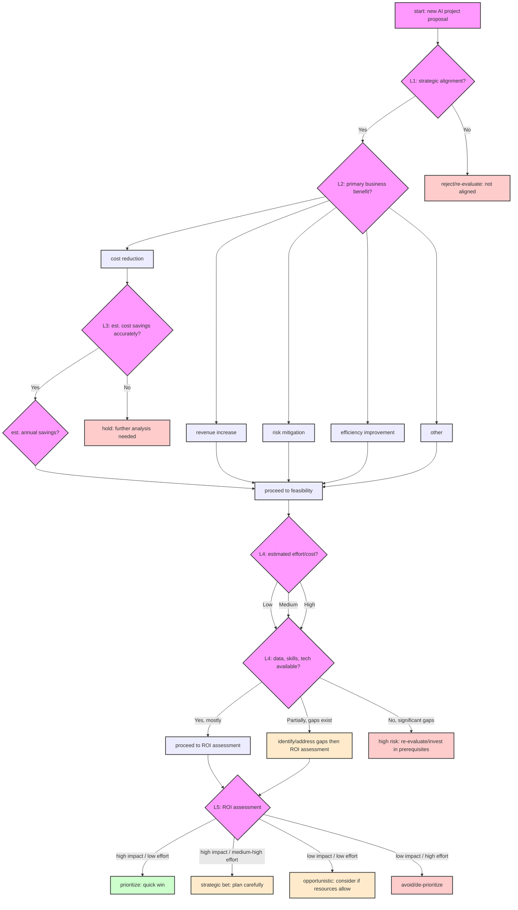

# Solution Notes: AI project ROI decision tree

## Assignment overview

This document outlines a starting point for creating a presentation on a decision tree to evaluate the return on investment (ROI) of AI projects. The context is a coffee company, covering its operations from importing beans to delivery. The target audience for the presentation is non-technical stakeholders.

The key deliverable is a decision tree that helps in the intake review process for new AI project proposals.

## Initial thoughts on the decision tree structure

A decision tree for evaluating AI project ROI for non-technical stakeholders should be simple, clear, and focus on business outcomes. Here's a potential starting structure:

### Level 1: Strategic alignment

*   **Question 1:** Does the proposed AI project directly align with our company's strategic objectives for coffee importing, roasting, distribution, or delivery?
    *   **Yes:** proceed to Level 2.
    *   **No:** re-evaluate or reject. (clearly state why it's not aligned).

### Level 2: Potential business impact

*   **Question 2:** What is the primary expected business benefit?
    *   **A) Cost reduction:** (e.g., optimizing delivery routes, reducing waste in roasting) -> proceed to impact quantification (A)
    *   **B) Revenue increase:** (e.g., personalized coffee recommendations, new market penetration through AI insights) -> proceed to impact quantification (B)
    *   **C) Risk mitigation:** (e.g., predicting supply chain disruptions, ensuring quality control) -> proceed to impact quantification (C)
    *   **D) Efficiency improvement:** (e.g., automating repetitive tasks in distribution) -> proceed to impact quantification (D)
    *   **Other (specify):** -> proceed to impact quantification (Other)

### Level 3: Impact quantification (Example for cost reduction)

*   **Question 3 (If cost reduction):** Can we estimate the potential cost savings with reasonable accuracy?
    *   **Yes:** What are the estimated annual savings? (e.g., <$50k, $50k-$200k, >$200k) -> proceed to feasibility.
    *   **No:** further analysis needed before proceeding. Hold.

*(Similar quantification questions would follow for revenue increase, risk mitigation, etc.)*

### Level 4: Feasibility & effort

*   **Question 4:** What is the estimated effort/cost to implement this AI project?
    *   **Low:** (e.g., <3 months, <$X budget)
    *   **Medium:** (e.g., 3-9 months, $X-$Y budget)
    *   **High:** (e.g., >9 months, >$Y budget)
*   **Question 5:** Do we have the necessary data, skills, and technology?
    *   **Yes, mostly:** proceed.
    *   **Partially, gaps exist:** identify gaps and plan to address.
    *   **No, significant gaps:** high risk. Re-evaluate or invest in prerequisites.

### Level 5: ROI Assessment & decision

*   **Based on impact vs. effort/cost:**
    *   **High impact / low effort:** prioritize (Quick win)
    *   **High impact / medium-high effort:** Strategic bet (plan carefully)
    *   **Low impact / low effort:** consider if resources allow (Opportunistic)
    *   **Low impact / high effort:** avoid or de-prioritize

### Mermaid Diagram: AI project ROI decision tree

*(Note: This Mermaid diagram provides a high-level overview. The "Impact Quantification" for benefits other than "Cost Reduction" are simplified to directly proceed to Feasibility for brevity in this main diagram. You might consider creating separate, more detailed diagrams for each benefit path if needed.)*

### Next steps for presentation:

*   Use coffee-specific examples for each branch.
*   Keep language simple and avoid technical jargon.
*   Focus on how this tree helps make informed decisions.

---

This is a preliminary structure. It will need refinement and specific examples relevant to the coffee company's operations.
