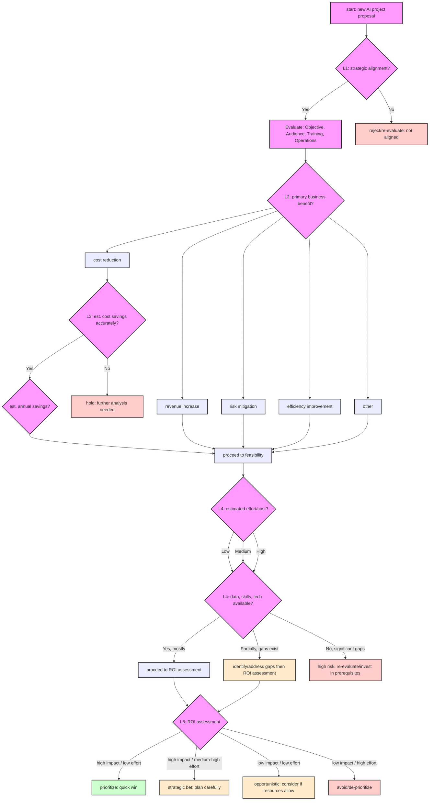

# Solution notes: AI project ROI decision tree

## Assignment overview

This document outlines a starting point for creating a presentation on a decision tree to evaluate the return on investment (ROI) of AI projects. The context is a coffee company, covering its operations from importing beans to delivery. The target audience for the presentation is non-technical stakeholders.

The key deliverable is a decision tree that helps in the intake review process for new AI project proposals.

## Initial thoughts on the decision tree structure

A decision tree for evaluating AI project ROI for non-technical stakeholders should be simple, clear, and focus on business outcomes. Here's a potential starting structure:

### Level 1: Strategic alignment

*   **Question 1:** Does the proposed AI project directly align with our company's strategic objectives for coffee importing, roasting, distribution, or delivery?
    *   **Yes:** proceed to Evaluate: Objective, Audience, Training, Operations.
    *   **No:** re-evaluate or reject. (clearly state why it's not aligned).

### Evaluate: Objective, Audience, Training, Operations

To assess the feasibility of an AI project, consider the following four pillars:

1. **Objective**: Clearly define the problem the AI project aims to solve. Ensure it aligns with the strategic goals of the company and addresses a specific pain point.
2. **Audience**: Estimate the number of paying customers or stakeholders who will benefit from the system. Quantify the potential positive impact on customer satisfaction or retention.
3. **Training**: Evaluate the time and cost required to classify the data and train the AI model. Consider the availability of labeled data and the complexity of the training process.
4. **Operations**: Assess the average daily cost of running the AI system in production. Include infrastructure, maintenance, and monitoring costs.

These pillars should be used alongside the existing feasibility criteria (data, skills, and technology readiness) to provide a comprehensive evaluation of the project's feasibility.

**Integration with decision tree**:
- After evaluating the four pillars, projects with high feasibility should proceed to ROI assessment.
- Projects with gaps in feasibility should identify and address these gaps before moving forward.

### Level 2: Potential business impact

*   **Question 2:** What is the primary expected business benefit?
    *   **A) Cost reduction:** (e.g., optimizing delivery routes, reducing waste in roasting) -> proceed to impact quantification (A)
    *   **B) Revenue increase:** (e.g., personalized coffee recommendations, new market penetration through AI insights) -> proceed to impact quantification (B)
    *   **C) Risk mitigation:** (e.g., predicting supply chain disruptions, ensuring quality control) -> proceed to impact quantification (C)
    *   **D) Efficiency improvement:** (e.g., automating repetitive tasks in distribution) -> proceed to impact quantification (D)
    *   **Other (specify):** -> proceed to impact quantification (Other)

### Level 3: Impact quantification (Example for cost reduction)

*   **Question 3 (If cost reduction):** Can we estimate the potential cost savings with reasonable accuracy?
    *   **Yes:** What are the estimated annual savings? (e.g., <$50k, $50k-$200k, >$200k) -> proceed to feasibility.
    *   **No:** further analysis needed before proceeding. Hold.

*(Similar quantification questions would follow for revenue increase, risk mitigation, etc.)*

### Level 4: Feasibility & effort

*   **Question 4:** What is the estimated effort/cost to implement this AI project?
    *   **Low:** (e.g., <3 months, <$X budget)
    *   **Medium:** (e.g., 3-9 months, $X-$Y budget)
    *   **High:** (e.g., >9 months, >$Y budget)
*   **Question 5:** Do we have the necessary data, skills, and technology?
    *   **Yes, mostly:** proceed.
    *   **Partially, gaps exist:** identify gaps and plan to address.
    *   **No, significant gaps:** high risk. Re-evaluate or invest in prerequisites.

### Level 5: ROI Assessment & decision

*   **Based on impact vs. effort/cost:**
    *   **High impact / low effort:** prioritize (Quick win)
    *   **High impact / medium-high effort:** Strategic bet (plan carefully)
    *   **Low impact / low effort:** consider if resources allow (Opportunistic)
    *   **Low impact / high effort:** avoid or de-prioritize

### Mermaid Diagram: AI project ROI decision tree

*(Note: This Mermaid diagram provides a high-level overview. The "Impact Quantification" for benefits other than "Cost Reduction" are simplified to directly proceed to Feasibility for brevity in this main diagram. You might consider creating separate, more detailed diagrams for each benefit path if needed.)*

### how the decision tree applies to coffee processes

#### coffee importing
- **strategic alignment:** does the ai project align with improving the efficiency or quality of coffee importing (e.g., predicting optimal sourcing regions, identifying cost-effective suppliers)?
- **business impact:** could it reduce costs (e.g., optimizing shipping routes, minimizing import tariffs) or mitigate risks (e.g., forecasting supply chain disruptions, ensuring compliance with import regulations)?
- **impact quantification:** can the cost savings or risk mitigation be quantified (e.g., reduced shipping costs, fewer delays, lower tariff expenses)?
- **feasibility:** do we have the data (e.g., historical import data, supplier performance metrics) and technology to implement the project?
- **roi assessment:** if the impact is high and effort is low, prioritize the project.

#### coffee roasting
- **strategic alignment:** does the ai project enhance roasting quality or reduce waste (e.g., optimizing roasting profiles, predicting bean quality)?
- **business impact:** could it improve efficiency (e.g., automating roasting adjustments, reducing energy consumption) or increase revenue (e.g., creating premium products, improving consistency for high-end markets)?
- **impact quantification:** can the benefits be measured (e.g., reduced waste, increased product value, lower energy costs)?
- **feasibility:** do we have the necessary data (e.g., roasting logs, energy usage data) and skills to implement the project?
- **roi assessment:** evaluate based on impact versus effort.

#### coffee distribution
- **strategic alignment:** does the ai project improve distribution efficiency (e.g., route optimization, warehouse management) or customer satisfaction (e.g., delivery tracking, accurate delivery time predictions)?
- **business impact:** could it reduce costs (e.g., fuel savings, optimized inventory levels) or increase revenue (e.g., faster delivery times, improved customer retention)?
- **impact quantification:** can the benefits be quantified (e.g., reduced delivery times, lower fuel costs, fewer stockouts)?
- **feasibility:** assess the availability of data (e.g., delivery logs, inventory data) and technology.
- **roi assessment:** prioritize projects with high impact and low effort.

#### coffee delivery
- **strategic alignment:** does the ai project enhance delivery operations (e.g., real-time tracking, automated delivery scheduling) or customer experience (e.g., personalized delivery options, proactive issue resolution)?
- **business impact:** could it increase efficiency (e.g., automating delivery scheduling, reducing failed deliveries) or revenue (e.g., improved customer retention, upselling opportunities during delivery)?
- **impact quantification:** can the benefits be measured (e.g., reduced delivery times, increased customer satisfaction, fewer failed deliveries)?
- **feasibility:** evaluate the data and technology readiness (e.g., gps tracking, customer feedback systems).
- **roi assessment:** focus on projects with significant benefits and manageable implementation effort.

### Example use case: Coffee roasting AI project

#### Applying the four pillars

1. **Objective**: The AI project aims to optimize coffee roasting profiles to enhance quality and reduce waste. This aligns with the strategic goal of improving product consistency and minimizing resource usage.
2. **Audience**: The primary beneficiaries are high-end market customers who demand consistent quality. This could positively impact approximately 30% of the customer base, leading to increased satisfaction and retention.
3. **Training**: The project requires historical roasting logs and energy usage data. The estimated time to classify the data and train the model is 2 months, with a cost of $20,000.
4. **Operations**: The AI system's daily operational cost, including cloud infrastructure and monitoring, is estimated at $50 per day.

#### Feasibility assessment
- **Data Availability**: Historical roasting logs and energy usage data are available.
- **Skills and Technology**: The team has expertise in machine learning and access to necessary tools.
- **Effort/Cost**: The project is categorized as low effort (<3 months, <$50,000 budget).

#### ROI assessment
- **Impact**: High impact due to improved product quality and reduced waste.
- **Effort**: Low effort, making this a quick win.

**Decision**: Prioritize this project as it offers high impact with manageable effort and cost.

### Example use case: Coffee importing AI project

#### Applying the four pillars

1. **Objective**: The AI project aims to predict optimal sourcing regions and identify cost-effective suppliers to improve the efficiency and quality of coffee importing.
2. **Audience**: The primary beneficiaries are procurement teams and suppliers, ensuring a steady supply of high-quality beans. This could positively impact the entire supply chain, reducing delays and costs.
3. **Training**: The project requires historical import data and supplier performance metrics. The estimated time to classify the data and train the model is 3 months, with a cost of $30,000.
4. **Operations**: The AI system's daily operational cost, including cloud infrastructure and monitoring, is estimated at $70 per day.

#### Feasibility assessment
- **Data availability**: Historical import data and supplier performance metrics are available.
- **Skills and technology**: The team has expertise in supply chain analytics and access to necessary tools.
- **Effort/cost**: The project is categorized as medium effort (3-9 months, $30,000 budget).

#### ROI assessment
- **Impact**: High impact due to reduced shipping costs and fewer delays.
- **Effort**: Medium effort, making this a strategic bet.

**Decision**: Proceed with careful planning as it offers significant benefits to the supply chain.

### Example use case: Coffee distribution AI project

#### Applying the four pillars

1. **Objective**: The AI project aims to optimize distribution routes and improve warehouse management to enhance efficiency and reduce costs.
2. **Audience**: The primary beneficiaries are logistics teams and customers, ensuring timely deliveries and reduced operational costs. This could positively impact 40% of the customer base.
3. **Training**: The project requires delivery logs and inventory data. The estimated time to classify the data and train the model is 4 months, with a cost of $25,000.
4. **Operations**: The AI system's daily operational cost, including cloud infrastructure and monitoring, is estimated at $60 per day.

#### Feasibility assessment
- **Data availability**: Delivery logs and inventory data are available.
- **Skills and technology**: The team has expertise in logistics optimization and access to necessary tools.
- **Effort/cost**: The project is categorized as medium effort (3-9 months, $25,000 budget).

#### ROI assessment
- **Impact**: High impact due to reduced fuel costs and improved customer satisfaction.
- **Effort**: Medium effort, making this a strategic bet.

**Decision**: Proceed with careful planning as it offers significant operational benefits.

### Example use case: Coffee delivery AI project

#### Applying the four pillars

1. **Objective**: The AI project aims to enhance delivery operations through real-time tracking and automated scheduling to improve customer experience.
2. **Audience**: The primary beneficiaries are end customers, ensuring timely and personalized deliveries. This could positively impact 50% of the customer base.
3. **Training**: The project requires GPS tracking data and customer feedback systems. The estimated time to classify the data and train the model is 2 months, with a cost of $15,000.
4. **Operations**: The AI system's daily operational cost, including cloud infrastructure and monitoring, is estimated at $40 per day.

#### Feasibility assessment
- **Data availability**: GPS tracking data and customer feedback systems are available.
- **Skills and technology**: The team has expertise in delivery optimization and access to necessary tools.
- **Effort/cost**: The project is categorized as low effort (<3 months, $15,000 budget).

#### ROI assessment
- **Impact**: High impact due to improved customer satisfaction and retention.
- **Effort**: Low effort, making this a quick win.

**Decision**: Prioritize this project as it offers high impact with manageable effort and cost.

### Next steps for presentation:

*   Use coffee-specific examples for each branch.
*   Keep language simple and avoid technical jargon.
*   Focus on how this tree helps make informed decisions.

---

This is a preliminary structure. It will need refinement and specific examples relevant to the coffee company's operations.
