# Azure AI Agent for Historical Trend Analysis
## Executive Presentation (5 Slides)

---

## Slide 1: Solution Overview

**Challenge:** Analyze 20+ years of invoices and bills of lading for historical trends

**Solution:** Agent-based trend analysis with controlled AI access
- Custom SQL-based DSL for secure data queries
- AI agent with code execution for dynamic analysis
- Scalable to 50-500 million documents

**Business Impact:** €150K+ annual savings with enterprise-grade security

---

## Slide 2: Architecture & Flow

### Core Services
- **Azure Data Lake** - Centralized document storage
- **Custom DSL Layer** - Controlled data access with guardrails
- **Azure OpenAI** - AI agent for trend analysis
- **Container Apps** - Code execution environment

### Architecture Flow Diagram

```mermaid
flowchart TD
    A["📄 Invoices & Bills of Lading<br/>(20+ years)"] --> B["🏢 Azure Data Lake<br/>Storage"]
    B --> C["🛡️ Custom DSL Layer<br/>(Security & Access Control)"]
    C --> D["🤖 Azure OpenAI Agent<br/>(Trend Analysis)"]
    D --> E["⚡ Code Execution<br/>Environment"]
    E --> F["📊 Dashboards & BI<br/>Reports"]
    
    G["👤 Azure Entra ID<br/>Authentication"] -.-> C
    H["📈 Monitoring &<br/>Logging"] -.-> D
    H -.-> E
    
    classDef storage fill:#e1f5fe,stroke:#01579b
    classDef ai fill:#f3e5f5,stroke:#4a148c
    classDef execution fill:#e8f5e8,stroke:#1b5e20
    classDef security fill:#fff3e0,stroke:#e65100
    
    class B storage
    class D ai
    class E execution
    class C,G security
```

---

## Slide 3: Cost & Scale

### Annual Investment (Usage-Dependent)
- **Small Scale:** €10,000/year (50M documents)
- **Enterprise Scale:** €100,000/year (500M documents)
- **Primary Costs:** Azure OpenAI (70%), Data Lake (15%), Other (15%)

### ROI: 175% - 2,650% depending on scale

---

## Slide 4: Security & Monitoring

### Enterprise Security
- **Custom DSL guardrails** prevent unauthorized queries
- **Role-based access** via Azure Entra ID
- **Data privacy** - Azure OpenAI contract ensures no training data use

### Key Monitoring
- Query response time: <3 seconds
- System uptime: 99.9%
- Cost variance: ±5%

---

## Slide 5: Next Steps

### Immediate Actions (30 Days)
1. **Approve pilot budget:** €10K for proof of concept
2. **Assemble team:** DSL developers + AI engineers
3. **Provision Azure environment:** Data Lake + OpenAI setup

### Implementation Timeline
- **Q3 2025:** Pilot with limited dataset
- **Q4 2025:** Full production deployment
- **Q1 2026:** Advanced analytics features

**Recommendation:** Start with pilot to validate approach before full-scale investment
