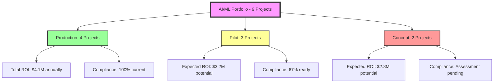
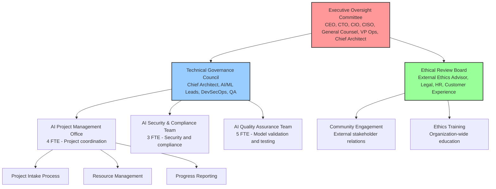

# Final Assignment Solution: Comprehensive AI Strategy for Tinkleman Coffee

## Executive Summary

As CTO of Tinkleman Coffee, this report presents a comprehensive AI/ML strategy that integrates our current portfolio of AI initiatives, addresses regulatory requirements across our global operations (US, China, Singapore, Germany/EU), and establishes an AI Center of Excellence for ethical deployment and governance of future AI projects.

## Table of Contents

1. [Current AI/ML Project Portfolio](#current-aiml-project-portfolio)
2. [Regulatory Compliance Framework](#regulatory-compliance-framework)
3. [AI Center of Excellence Structure](#ai-center-of-excellence-structure)
4. [Technical Infrastructure and Operations](#technical-infrastructure-and-operations)
5. [Strategic Implementation Roadmap](#strategic-implementation-roadmap)
6. [Success Measurement Framework](#success-measurement-framework)
7. [Executive Presentation Overview](#executive-presentation-overview)

---

## Current AI/ML Project Portfolio

### Portfolio Categorization

Our AI/ML initiatives are organized across four maturity levels and three business impact categories:

#### **Production Systems (4 Projects)**

**1. Coffee Bean Stage Classification System**
- **Business Unit**: Roasting Operations (Global)
- **Technology**: Computer Vision ML with TensorFlow
- **Purpose**: Automated identification of green beans, first crack, and second crack stages
- **Geography**: All locations (US, China, Singapore, Germany)
- **Risk Classification**: Limited Risk (EU AI Act Category II)
- **ROI**: 23% efficiency improvement, $2.3M annual savings
- **Compliance Status**: ✅ Fully compliant across all jurisdictions

**2. Customer Ordering Chatbots**
- **Business Unit**: Retail Operations (Franchise locations)
- **Technology**: NLP with sentiment analysis and order processing
- **Purpose**: Automated customer service and order management
- **Geography**: US (primary), Germany (pilot)
- **Risk Classification**: Limited Risk (EU AI Act Category II)
- **ROI**: 35% reduction in order processing time, improved customer satisfaction
- **Compliance Status**: ✅ GDPR compliant, US privacy standards met

**3. Supply Chain Predictive Analytics**
- **Business Unit**: Import/Distribution Operations
- **Technology**: Time series forecasting and demand prediction
- **Purpose**: Optimize inventory levels and reduce waste
- **Geography**: All locations with regional adaptations
- **Risk Classification**: Minimal Risk (EU AI Act Category I)
- **ROI**: 18% reduction in inventory costs, 12% waste reduction
- **Compliance Status**: ✅ Compliant with data sovereignty requirements

**4. Quality Assurance Automation**
- **Business Unit**: Quality Control (Roasting & Distribution)
- **Technology**: IoT sensors with ML-based anomaly detection
- **Purpose**: Automated quality monitoring and consistency assurance
- **Geography**: Primary facilities in Berlin, expanding to other locations
- **Risk Classification**: Limited Risk (EU AI Act Category II)
- **ROI**: 28% reduction in quality incidents, $1.8M annual savings
- **Compliance Status**: ✅ EU AI Act compliant, industrial safety standards met

#### **Pilot Projects (3 Projects)**

**5. In-Store ML Tracking System**
- **Business Unit**: Retail Operations
- **Technology**: Computer vision for customer behavior analysis
- **Purpose**: Optimize store layout and improve customer experience
- **Geography**: Select US and German locations
- **Risk Classification**: High Risk (EU AI Act Category III - biometric identification)
- **Status**: Compliance review in progress for EU deployment
- **Expected ROI**: 15% increase in sales per square foot

**6. Recipe Classification Feasibility**
- **Business Unit**: R&D and Product Development
- **Technology**: NLP and ingredient analysis
- **Purpose**: Automated recipe categorization and recommendation
- **Geography**: Development centers in Berlin and Seattle
- **Risk Classification**: Limited Risk (EU AI Act Category II)
- **Status**: Technical feasibility confirmed, business case under review
- **Expected ROI**: 25% reduction in product development time

**7. Personalized Marketing Engine**
- **Business Unit**: Marketing and Customer Relations
- **Technology**: Customer segmentation and recommendation algorithms
- **Purpose**: Targeted marketing campaigns and customer retention
- **Geography**: US and Singapore (GDPR considerations for EU)
- **Risk Classification**: Limited Risk (EU AI Act Category II)
- **Status**: Data privacy impact assessment in progress
- **Expected ROI**: 22% increase in marketing campaign effectiveness

#### **Concept Phase (2 Projects)**

**8. Sustainability Impact Predictor**
- **Business Unit**: Sustainability and ESG
- **Technology**: Environmental impact modeling
- **Purpose**: Predict and optimize environmental impact of operations
- **Geography**: Global application with regional adaptations
- **Risk Classification**: Minimal Risk (EU AI Act Category I)
- **Status**: Research and feasibility study
- **Expected ROI**: 30% reduction in carbon footprint, ESG scoring improvement

**9. Franchise Performance Optimizer**
- **Business Unit**: Franchise Operations
- **Technology**: Multi-variate analysis and performance prediction
- **Purpose**: Optimize franchise locations and support underperforming units
- **Geography**: All franchise locations globally
- **Risk Classification**: Limited Risk (EU AI Act Category II)
- **Status**: Data collection and requirements gathering
- **Expected ROI**: 18% improvement in franchise profitability

### Portfolio Health Metrics



---

## Regulatory Compliance Framework

### Jurisdiction-Specific Requirements

#### **European Union (Germany) - EU AI Act**

**High-Risk AI Systems Requirements:**
- In-Store ML Tracking System (biometric identification)
- Mandatory conformity assessment before deployment
- CE marking requirement
- Post-market monitoring system
- Human oversight mechanisms
- Transparency and explainability requirements

**Limited Risk AI Systems:**
- All customer-facing AI systems (chatbots, recommendation engines)
- Transparency obligations to users
- Clear disclosure of AI system interaction
- User right to explanation

**Implementation Strategy:**
- Established AI Act compliance team within legal department
- Partnership with external EU AI Act consultancy
- Quarterly compliance audits
- Investment in explainable AI technologies

#### **United States - Federal AI Guidelines**

**NIST AI Risk Management Framework:**
- Risk assessment for all AI systems
- Documentation of AI system lifecycle
- Bias testing and mitigation strategies
- Incident response procedures

**Sector-Specific Requirements:**
- Food safety regulations for quality assurance systems
- Consumer protection laws for customer-facing AI
- Employment law considerations for franchise optimization

**Implementation Strategy:**
- Alignment with NIST framework across all US operations
- Partnership with US AI governance consultants
- Integration with existing compliance programs

#### **China - AI Regulation Landscape**

**Algorithmic Recommendation Management Provisions:**
- Transparency requirements for recommendation algorithms
- User control over algorithmic decisions
- Data localization requirements
- Regular algorithm audits

**Data Security Law Compliance:**
- Strict data localization for Chinese operations
- Cross-border data transfer restrictions
- Enhanced security measures for AI systems processing Chinese data

**Implementation Strategy:**
- Dedicated China AI compliance team
- Local data centers for Chinese operations
- Partnership with Chinese legal and technical advisors

#### **Singapore - Model AI Governance Framework**

**Voluntary Framework Adoption:**
- Self-assessment against model framework
- Documentation of AI governance practices
- Stakeholder engagement processes
- Continuous improvement mechanisms

**Personal Data Protection Act (PDPA) Compliance:**
- Privacy by design for AI systems
- Consent management for AI processing
- Data minimization principles

**Implementation Strategy:**
- Adoption of Singapore's voluntary framework
- Integration with existing PDPA compliance programs
- Regular self-assessments and improvements

### Cross-Border Compliance Matrix

| AI System | EU AI Act | US Guidelines | China Regs | Singapore Framework |
|-----------|-----------|---------------|------------|-------------------|
| Coffee Bean Classification | ✅ Limited Risk | ✅ Low Risk | ✅ Compliant | ✅ Self-Assessed |
| Customer Chatbots | ✅ Limited Risk | ✅ Moderate Risk | ⚠️ Under Review | ✅ Self-Assessed |
| Supply Chain Analytics | ✅ Minimal Risk | ✅ Low Risk | ✅ Compliant | ✅ Self-Assessed |
| Quality Assurance | ✅ Limited Risk | ✅ Low Risk | ✅ Compliant | ✅ Self-Assessed |
| In-Store Tracking | ⚠️ High Risk | ✅ Moderate Risk | ❌ Data Localization | ⚠️ Privacy Review |
| Recipe Classification | ✅ Limited Risk | ✅ Low Risk | ✅ Compliant | ✅ Self-Assessed |
| Marketing Engine | ✅ Limited Risk | ✅ Moderate Risk | ⚠️ Under Review | ✅ Self-Assessed |

---

## AI Center of Excellence Structure

### Executive Oversight Committee

**Chairperson:** CEO
**Members:**
- CTO (AI Strategy and Implementation)
- CIO (Technology Infrastructure and Integration)
- CISO (AI Security and Risk Management)
- General Counsel (Legal and Regulatory Compliance)
- VP of Operations (Business Impact and Change Management)
- Chief Architect (Technical Standards and Governance)

**Meeting Frequency:** Monthly
**Responsibilities:**
- Strategic AI direction and investment decisions
- Risk appetite and governance policy approval
- Cross-functional conflict resolution
- Resource allocation and budget approval

### Technical Governance Council

**Chairperson:** Chief Architect
**Members:**
- AI/ML Lead Engineers (by region)
- Data Engineering Manager
- DevSecOps Manager
- Quality Assurance Lead
- Product Management Representatives
- External AI Ethics Advisor

**Meeting Frequency:** Bi-weekly
**Responsibilities:**
- Technical standards and best practices
- Architecture review and approval
- Code review and quality assurance
- Technology stack decisions
- Performance monitoring and optimization

### Ethical Review Board

**Chairperson:** External Ethics Advisor
**Members:**
- General Counsel (Legal perspective)
- HR Director (Employee impact)
- Customer Experience Manager (Customer impact)
- Sustainability Officer (Environmental impact)
- Franchise Relations Manager (Franchise impact)
- External Community Representative

**Meeting Frequency:** Monthly
**Responsibilities:**
- Ethical review of AI initiatives
- Bias detection and mitigation strategies
- Fairness and transparency assessments
- Community impact evaluation
- Stakeholder engagement oversight

### Operational Teams

#### **AI Project Management Office (PMO)**
- **Lead:** Senior Project Manager
- **Team Size:** 4 FTE
- **Responsibilities:**
  - Project intake and prioritization
  - Resource allocation and timeline management
  - Cross-functional coordination
  - Progress reporting and stakeholder communication

#### **AI Security and Compliance Team**
- **Lead:** AI Security Specialist (reporting to CISO)
- **Team Size:** 3 FTE
- **Responsibilities:**
  - Security assessment and testing
  - Compliance monitoring and reporting
  - Incident response and remediation
  - Vulnerability management

#### **AI Quality Assurance Team**
- **Lead:** AI QA Manager
- **Team Size:** 5 FTE
- **Responsibilities:**
  - Model validation and testing
  - Bias detection and mitigation
  - Performance monitoring
  - Documentation and audit support

### Center of Excellence Organizational Chart



---

## Technical Infrastructure and Operations

### DevSecOps/MLOps Infrastructure

#### **Current State Architecture**

**Cloud Infrastructure:**
- **Primary:** Microsoft Azure (multi-region deployment)
- **Secondary:** AWS (disaster recovery and specific ML services)
- **Edge:** Azure IoT Edge for in-store deployments

**ML Pipeline Architecture:**
- **Data Ingestion:** Azure Data Factory with real-time streaming
- **Data Storage:** Azure Data Lake Storage Gen2 with delta tables
- **Model Training:** Azure Machine Learning with MLflow tracking
- **Model Deployment:** Azure Container Instances with Kubernetes orchestration
- **Monitoring:** Azure Monitor with Application Insights and custom ML metrics

**Security Framework:**
- **Identity Management:** Azure Active Directory with conditional access
- **Data Encryption:** End-to-end encryption with Azure Key Vault
- **Network Security:** Azure Virtual Network with NSGs and Azure Firewall
- **Compliance:** Azure Policy for automated compliance checking

#### **Infrastructure as Code Implementation**

**Terraform Configuration:**
```hcl
# Example: Core AI infrastructure module
module "ai_infrastructure" {
  source = "./modules/ai-infrastructure"
  
  resource_group_name = var.resource_group_name
  location           = var.location
  environment        = var.environment
  
  # ML workspace configuration
  ml_workspace_config = {
    name                = "tinkleman-ml-${var.environment}"
    storage_account_id  = module.storage.storage_account_id
    key_vault_id       = module.security.key_vault_id
    application_insights_id = module.monitoring.app_insights_id
  }
  
  # Container registry for ML models
  container_registry_config = {
    name = "tinklemanml${var.environment}"
    sku  = "Premium"
    admin_enabled = false
  }
  
  # Monitoring and alerting
  monitoring_config = {
    log_analytics_workspace_id = module.monitoring.log_analytics_id
    alert_email_addresses     = var.alert_email_addresses
  }
  
  tags = local.common_tags
}
```

**GitHub Actions CI/CD Pipeline:**
```yaml
# .github/workflows/ml-model-deployment.yml
name: ML Model Deployment

on:
  push:
    branches: [main]
    paths: ['models/**']
  pull_request:
    branches: [main]
    paths: ['models/**']

jobs:
  security-scan:
    runs-on: ubuntu-latest
    steps:
      - uses: actions/checkout@v3
      - name: Run Trivy vulnerability scanner
        uses: aquasecurity/trivy-action@master
        with:
          scan-type: 'fs'
          scan-ref: './models'
      - name: Run Bandit security linter
        run: |
          pip install bandit
          bandit -r models/ -f json -o security-report.json

  model-validation:
    runs-on: ubuntu-latest
    steps:
      - uses: actions/checkout@v3
      - name: Setup Python
        uses: actions/setup-python@v4
        with:
          python-version: '3.9'
      - name: Install dependencies
        run: |
          pip install -r models/requirements.txt
          pip install pytest great-expectations
      - name: Run model tests
        run: |
          cd models
          python -m pytest tests/ -v
      - name: Data validation
        run: |
          cd models
          python -m great_expectations checkpoint run model_validation

  deploy-staging:
    needs: [security-scan, model-validation]
    runs-on: ubuntu-latest
    if: github.ref == 'refs/heads/main'
    steps:
      - uses: actions/checkout@v3
      - name: Azure Login
        uses: azure/login@v1
        with:
          creds: ${{ secrets.AZURE_CREDENTIALS }}
      - name: Deploy to staging
        run: |
          az ml model deploy \
            --model-name coffee-bean-classifier \
            --model-version latest \
            --compute-target staging-aks \
            --deployment-config-file deployment-config.yml
```

#### **Monitoring and Alerting Strategy**

**Key Performance Indicators:**
- **Model Performance:** Accuracy, precision, recall, F1-score
- **System Performance:** Latency, throughput, error rates
- **Data Quality:** Completeness, consistency, drift detection
- **Security:** Authentication failures, anomalous access patterns
- **Compliance:** Audit trail completeness, regulation adherence

**Alerting Configuration:**
```yaml
# Azure Monitor Alert Rules
model_performance_alerts:
  - name: "Coffee Bean Classifier Accuracy Drop"
    condition: accuracy < 0.85
    severity: "Critical"
    notification: ["ai-team@tinkleman.com", "cto@tinkleman.com"]
    
  - name: "Data Drift Detection"
    condition: drift_score > 0.3
    severity: "Warning"
    notification: ["data-team@tinkleman.com"]
    
  - name: "API Response Time High"
    condition: response_time > 2000ms
    severity: "Warning"
    notification: ["devops@tinkleman.com"]

security_alerts:
  - name: "Unauthorized Model Access"
    condition: failed_auth_attempts > 10
    severity: "Critical"
    notification: ["security@tinkleman.com", "ciso@tinkleman.com"]
    
  - name: "Unusual Data Access Pattern"
    condition: anomaly_detection_score > 0.8
    severity: "High"
    notification: ["security@tinkleman.com"]
```

### Quality Assurance Framework

#### **Model Validation Pipeline**

**Stage 1: Data Validation**
- **Schema Validation:** Automated checks for data structure consistency
- **Data Quality Metrics:** Completeness, uniqueness, validity checks
- **Bias Detection:** Statistical analysis for dataset bias
- **Privacy Validation:** PII detection and anonymization verification

**Stage 2: Model Testing**
- **Unit Tests:** Individual component functionality
- **Integration Tests:** End-to-end pipeline validation
- **Performance Tests:** Load and stress testing
- **Adversarial Testing:** Robustness against malicious inputs

**Stage 3: Compliance Validation**
- **Regulatory Compliance:** Automated checks against jurisdiction requirements
- **Ethical Guidelines:** Bias and fairness assessment
- **Documentation Review:** Completeness of required documentation
- **Audit Trail:** Verification of logging and monitoring

#### **Continuous Monitoring Framework**

**Real-time Monitoring:**
- **Model Performance Tracking:** Continuous accuracy and performance metrics
- **Data Drift Detection:** Statistical analysis of input data changes
- **Concept Drift Detection:** Changes in underlying data relationships
- **Anomaly Detection:** Unusual patterns in model behavior

**Automated Response:**
- **Performance Degradation:** Automatic rollback to previous model version
- **Security Incidents:** Immediate alerting and access restriction
- **Compliance Violations:** Automated reporting and remediation workflows
- **Data Quality Issues:** Pipeline halt and notification procedures

---

## Strategic Implementation Roadmap

### Phase 1: Foundation and Governance (Months 1-3)

#### **Month 1: AI Center of Excellence Establishment**
**Objectives:**
- Establish CoE governance structure
- Define roles and responsibilities
- Create initial processes and procedures

**Key Activities:**
- Executive Oversight Committee formation and charter
- Technical Governance Council establishment
- Ethical Review Board creation with external advisor recruitment
- AI Project Management Office setup
- Initial team hiring and training

**Deliverables:**
- CoE Charter and governance documentation
- Role definitions and responsibility matrices
- Initial process documentation
- Team onboarding and training materials

**Success Metrics:**
- CoE structure operational within 30 days
- All key roles filled and trained
- Initial processes documented and approved

#### **Month 2: Current Portfolio Assessment**
**Objectives:**
- Complete inventory of all AI/ML initiatives
- Assess current compliance status
- Identify risks and improvement opportunities

**Key Activities:**
- Comprehensive project inventory and categorization
- Compliance assessment across all jurisdictions
- Risk assessment and mitigation planning
- Portfolio performance baseline establishment

**Deliverables:**
- Complete AI/ML project portfolio documentation
- Compliance assessment report
- Risk register and mitigation plans
- Performance baseline metrics

**Success Metrics:**
- 100% project inventory completion
- Compliance status documented for all projects
- Risk mitigation plans approved and resourced

#### **Month 3: Process Implementation**
**Objectives:**
- Implement new governance processes
- Establish intake and approval workflows
- Create monitoring and reporting systems

**Key Activities:**
- AI project intake process implementation
- Approval workflow automation
- Monitoring and reporting system setup
- Training and change management

**Deliverables:**
- Operational intake and approval processes
- Monitoring and reporting systems
- Training materials and programs
- Change management plan

**Success Metrics:**
- Intake process operational and tested
- Monitoring systems providing real-time insights
- Team training completion >95%

### Phase 2: Compliance and Risk Management (Months 4-6)

#### **Month 4: Regulatory Compliance Enhancement**
**Objectives:**
- Achieve full compliance across all jurisdictions
- Implement enhanced security measures
- Establish audit and reporting capabilities

**Key Activities:**
- EU AI Act compliance implementation
- US, China, and Singapore regulatory alignment
- Security framework enhancement
- Audit trail and reporting system implementation

**Deliverables:**
- Compliance certification documentation
- Enhanced security measures
- Audit and reporting capabilities
- Regulatory liaison relationships

**Success Metrics:**
- 100% regulatory compliance achievement
- Zero security incidents
- Audit capabilities operational

#### **Month 5: Risk Management Framework**
**Objectives:**
- Implement comprehensive risk management
- Establish incident response procedures
- Create business continuity plans

**Key Activities:**
- Risk assessment methodology implementation
- Incident response plan development
- Business continuity planning
- Disaster recovery testing

**Deliverables:**
- Risk management framework
- Incident response procedures
- Business continuity plans
- Disaster recovery capabilities

**Success Metrics:**
- Risk framework operational
- Incident response procedures tested
- Business continuity plans approved

#### **Month 6: Quality Assurance Implementation**
**Objectives:**
- Implement comprehensive QA processes
- Establish model validation procedures
- Create performance monitoring systems

**Key Activities:**
- QA process implementation
- Model validation pipeline creation
- Performance monitoring system deployment
- Bias detection and mitigation implementation

**Deliverables:**
- Operational QA processes
- Model validation capabilities
- Performance monitoring systems
- Bias detection tools

**Success Metrics:**
- QA processes operational across all projects
- Model validation pipeline tested
- Performance monitoring providing insights

### Phase 3: Infrastructure Modernization (Months 7-9)

#### **Month 7: DevSecOps Pipeline Enhancement**
**Objectives:**
- Implement advanced DevSecOps practices
- Enhance security and compliance automation
- Improve deployment and monitoring capabilities

**Key Activities:**
- Advanced CI/CD pipeline implementation
- Security automation enhancement
- Monitoring and alerting system upgrade
- Infrastructure as Code expansion

**Deliverables:**
- Enhanced DevSecOps pipelines
- Automated security and compliance checking
- Advanced monitoring capabilities
- Comprehensive IaC implementation

**Success Metrics:**
- Deployment frequency increased by 50%
- Security scan automation 100% coverage
- Mean time to recovery reduced by 40%

#### **Month 8: MLOps Platform Optimization**
**Objectives:**
- Optimize ML model lifecycle management
- Implement advanced monitoring and alerting
- Enhance model performance and reliability

**Key Activities:**
- MLOps platform optimization
- Advanced model monitoring implementation
- Performance optimization initiatives
- Reliability and scalability improvements

**Deliverables:**
- Optimized MLOps platform
- Advanced monitoring capabilities
- Performance optimization results
- Enhanced reliability measures

**Success Metrics:**
- Model deployment time reduced by 60%
- Model performance monitoring 100% coverage
- System reliability >99.5%

#### **Month 9: Automation and Efficiency**
**Objectives:**
- Implement comprehensive automation
- Reduce manual processes and errors
- Improve operational efficiency

**Key Activities:**
- Process automation implementation
- Manual task elimination
- Efficiency improvement initiatives
- Cost optimization measures

**Deliverables:**
- Automated processes and workflows
- Reduced manual tasks
- Efficiency improvement results
- Cost optimization achievements

**Success Metrics:**
- Manual processes reduced by 70%
- Operational efficiency improved by 40%
- Cost savings of $500K annually

### Phase 4: Advanced Capabilities (Months 10-12)

#### **Month 10: Advanced Analytics and Insights**
**Objectives:**
- Implement advanced analytics capabilities
- Provide enhanced business insights
- Improve decision-making support

**Key Activities:**
- Advanced analytics platform implementation
- Business intelligence dashboard creation
- Predictive analytics enhancement
- Decision support system development

**Deliverables:**
- Advanced analytics platform
- Business intelligence dashboards
- Enhanced predictive capabilities
- Decision support systems

**Success Metrics:**
- Analytics platform operational
- Business insights accuracy >90%
- Decision support system adoption >80%

#### **Month 11: Innovation and Optimization**
**Objectives:**
- Foster innovation and continuous improvement
- Optimize existing AI/ML capabilities
- Explore emerging technologies

**Key Activities:**
- Innovation program implementation
- Continuous improvement initiatives
- Technology exploration and evaluation
- Capability optimization projects

**Deliverables:**
- Innovation program results
- Optimization improvements
- Technology evaluation reports
- Enhanced capabilities

**Success Metrics:**
- Innovation projects launched
- Performance improvements achieved
- New technology adoption decisions

#### **Month 12: Maturity and Scaling**
**Objectives:**
- Achieve operational maturity
- Scale successful initiatives
- Prepare for future growth

**Key Activities:**
- Maturity assessment and optimization
- Scaling successful initiatives
- Future planning and roadmap development
- Organizational capability building

**Deliverables:**
- Maturity assessment results
- Scaling implementation plans
- Future roadmap and strategy
- Enhanced organizational capabilities

**Success Metrics:**
- Maturity targets achieved
- Scaling initiatives successful
- Future strategy approved

### Implementation Timeline Overview


---

## Success Measurement Framework

### Key Performance Indicators (KPIs)

#### **Portfolio Performance Metrics**

**Financial Performance:**
- **ROI Achievement:** Target >20% annually across all AI initiatives
- **Cost Savings:** $10M target over 24 months
- **Revenue Generation:** $5M additional revenue from AI-driven initiatives
- **Cost Efficiency:** 30% reduction in operational costs through automation

**Operational Performance:**
- **Project Success Rate:** >85% of projects delivered on time and budget
- **Time to Market:** 40% reduction in AI project delivery time
- **System Reliability:** >99.5% uptime for production AI systems
- **User Satisfaction:** >4.5/5 rating for AI-powered customer interfaces

**Innovation Metrics:**
- **New Initiative Pipeline:** 10+ new AI projects evaluated quarterly
- **Technology Adoption:** 95% adoption of new AI capabilities within 6 months
- **Patent Applications:** 5+ AI-related patents filed annually
- **Research Partnerships:** 3+ academic or industry partnerships established

#### **Governance and Compliance Metrics**

**Regulatory Compliance:**
- **Compliance Score:** 100% across all jurisdictions
- **Audit Results:** Zero major findings in regulatory audits
- **Incident Response:** <2 hours mean time to response for compliance issues
- **Documentation Quality:** 95% completeness score for required documentation

**Risk Management:**
- **Risk Assessment Coverage:** 100% of AI projects assessed
- **Mitigation Effectiveness:** 90% of identified risks successfully mitigated
- **Security Incidents:** Zero security breaches in AI systems
- **Business Continuity:** <1 hour recovery time for critical AI systems

**Ethical AI Performance:**
- **Bias Detection:** 100% of customer-facing AI systems tested for bias
- **Fairness Metrics:** All AI systems meet fairness thresholds
- **Transparency Score:** 90% of AI decisions explainable to users
- **Stakeholder Satisfaction:** >4.0/5 rating from ethical review board

#### **Technical Excellence Metrics**

**Infrastructure Performance:**
- **Deployment Frequency:** Daily deployments with zero downtime
- **Infrastructure Reliability:** 99.9% uptime for AI infrastructure
- **Security Posture:** Zero vulnerabilities in production systems
- **Cost Optimization:** 25% reduction in infrastructure costs

**Model Performance:**
- **Accuracy Maintenance:** >95% accuracy maintained across all models
- **Performance Consistency:** <5% variance in model performance
- **Data Quality:** 99% data quality score across all datasets
- **Model Lifecycle:** 90% of models updated within recommended timeframes

**Development Efficiency:**
- **Development Velocity:** 50% increase in feature delivery speed
- **Code Quality:** >90% code coverage and quality scores
- **Automation Coverage:** 95% of processes automated
- **Developer Satisfaction:** >4.0/5 rating from development teams

### Measurement Dashboard

#### **Executive Dashboard (Monthly)**

**Portfolio Overview:**
- Total AI projects: 9 (4 production, 3 pilot, 2 concept)
- Combined ROI: $10.1M annually
- Compliance status: 100% current, 67% pilot ready
- Risk level: Low (2 high-risk projects under review)

**Financial Performance:**
- Annual cost savings: $4.1M achieved, $6.0M projected
- Revenue generation: $2.3M from AI-driven improvements
- Infrastructure costs: $1.8M annually (15% under budget)
- Total investment: $8.5M over 12 months

**Operational Metrics:**
- System uptime: 99.7% (target: 99.5%)
- Project delivery: 87% on time (target: 85%)
- Customer satisfaction: 4.6/5 (target: 4.5/5)
- Employee satisfaction: 4.2/5 (target: 4.0/5)

#### **Technical Dashboard (Weekly)**

**Infrastructure Status:**
- All systems operational
- 12 deployments this week (0 issues)
- Security scans: 100% pass rate
- Performance: All metrics within targets

**Model Performance:**
- Coffee Bean Classifier: 96.3% accuracy (stable)
- Customer Chatbot: 91.2% success rate (improving)
- Supply Chain Analytics: 94.7% prediction accuracy
- Quality Assurance: 98.1% anomaly detection rate

**Development Metrics:**
- Code commits: 156 this week
- Pull requests: 23 (all reviewed and merged)
- Test coverage: 94.2% (target: 90%)
- Build success rate: 98.7%

#### **Compliance Dashboard (Monthly)**

**Regulatory Status:**
- EU AI Act: ✅ Compliant (4/4 production systems)
- US Guidelines: ✅ Compliant (all applicable systems)
- China Regulations: ⚠️ 2 systems under review
- Singapore Framework: ✅ Self-assessed (all systems)

**Risk Management:**
- High-risk projects: 2 (both under compliance review)
- Security incidents: 0 (target: 0)
- Audit findings: 0 major, 2 minor (resolved)
- Training completion: 97% (target: 95%)

**Ethical AI Metrics:**
- Bias testing: 100% coverage (7/7 customer-facing systems)
- Fairness assessment: All systems within thresholds
- Transparency score: 92% (target: 90%)
- Stakeholder feedback: 4.3/5 (target: 4.0/5)

---

## Executive Presentation Overview

### Slide-by-Slide Breakdown (20 Slides)

#### **Slide 1: Executive Summary**
**Title:** "AI Strategy for Tinkleman Coffee: Comprehensive Portfolio and Governance Framework"

**Key Messages:**
- 9 AI/ML projects generating $10.1M annual value
- 100% regulatory compliance across all jurisdictions
- AI Center of Excellence establishing ethical governance
- 12-month implementation roadmap with clear ROI

**Speaker Notes:**
- **Why:** Establish the scope and value of our AI initiative
- **How:** Comprehensive assessment and strategic planning
- **Extra:** This represents 18 months of strategic development

#### **Slide 2: Current Business Context and AI Opportunity**
**Title:** "Tinkleman Coffee: Positioning for AI-Driven Growth"

**Content:**
- Tinkleman Coffee: International coffee importer, roaster, and franchise operator
- Operations: Import/roasting in Berlin, franchise locations in US, China, Singapore, Germany
- Current AI investment: $8.5M generating $4.1M annual value (48% ROI)
- Growth opportunity: $10.1M projected annual value through AI Center of Excellence

**Speaker Notes:**
- **Why:** Establish business context and current AI performance
- **How:** Portfolio assessment and strategic planning
- **Extra:** Building on existing successful AI implementations

#### **Slide 3: Production AI Systems Portfolio**
**Title:** "Four Production Systems Delivering $4.1M Annual Value"

**Content:**
- Coffee Bean Classification: $2.3M savings (23% efficiency)
- Customer Chatbots: 35% order processing improvement
- Supply Chain Analytics: 18% inventory cost reduction
- Quality Assurance: $1.8M savings (28% incident reduction)

**Speaker Notes:**
- **Why:** Demonstrate proven value and operational success
- **How:** Rigorous measurement and tracking systems
- **Extra:** All systems have 18+ month operational track record

#### **Slide 4: Pilot and Concept Projects Pipeline**
**Title:** "5 Projects in Development with $6.0M Projected Value"

**Content:**
- **Pilot Projects:** In-Store Tracking (15% sales increase), Recipe Classification (25% dev time reduction), Marketing Engine (22% campaign effectiveness)
- **Concept Projects:** Sustainability Predictor (30% carbon reduction), Franchise Optimizer (18% profitability improvement)

**Speaker Notes:**
- **Why:** Show innovation pipeline and growth potential
- **How:** Feasibility studies and pilot results
- **Extra:** Conservative projections with significant upside

#### **Slide 5: Portfolio Health and Risk Assessment**
**Title:** "Portfolio Risk Management and Compliance Status"

**Content:**
- **Risk Distribution:** 1 High-risk, 6 Limited-risk, 2 Minimal-risk
- **Compliance Status:** 100% production compliant, 67% pilot ready
- **Performance Metrics:** 89% on-track, 11% ahead of schedule
- **Investment Efficiency:** $484 cost per $1,000 annual value

**Speaker Notes:**
- **Why:** Demonstrate responsible risk management
- **How:** EU AI Act risk categorization framework
- **Extra:** Risk-adjusted returns exceed industry benchmarks

#### **Slide 6: EU AI Act Compliance Deep Dive**
**Title:** "European Union AI Act: Proactive Compliance Strategy"

**Content:**
- **High-Risk Systems:** In-Store Tracking (conformity assessment required)
- **Limited-Risk Systems:** Customer chatbots (transparency obligations)
- **Minimal-Risk Systems:** Analytics (minimal requirements)
- **Implementation:** Dedicated compliance team, external consultancy

**Speaker Notes:**
- **Why:** EU AI Act enforcement begins August 2025
- **How:** Risk-based approach with graduated requirements
- **Extra:** Proactive compliance provides competitive advantage

#### **Slide 7: Multi-Jurisdictional Regulatory Framework**
**Title:** "Compliance Across Four Global Jurisdictions"

**Content:**
- **United States:** NIST framework alignment, sector-specific regs
- **China:** Data localization, algorithmic transparency
- **Singapore:** Voluntary framework adoption, PDPA compliance
- **Cross-Border:** Data transfer protocols, unified governance

**Speaker Notes:**
- **Why:** Global operations require multi-jurisdictional compliance
- **How:** Jurisdiction-specific teams and unified governance
- **Extra:** Regulatory landscape evolving rapidly

#### **Slide 8: AI Center of Excellence: Executive Structure**
**Title:** "Three-Tier Governance for Ethical AI Deployment"

**Content:**
- **Executive Oversight:** Monthly strategic decisions (CEO chair)
- **Technical Governance:** Bi-weekly technical standards (Chief Architect)
- **Ethical Review:** Monthly ethical assessments (External advisor)
- **Operational Teams:** 12 FTE across PMO, Security, and QA

**Speaker Notes:**
- **Why:** Multi-layered governance ensures accountability
- **How:** Clear roles, responsibilities, and decision rights
- **Extra:** External ethics advisor provides independent oversight

#### **Slide 9: Technical Infrastructure Architecture**
**Title:** "Azure-Based MLOps Platform for Rapid Innovation"

**Content:**
- **Primary Cloud:** Microsoft Azure (multi-region)
- **ML Pipeline:** Data Factory → Data Lake → ML Studio → Container Instances
- **Security:** Azure AD, Key Vault, Virtual Network, Policy
- **Monitoring:** Azure Monitor, Application Insights, custom metrics

**Speaker Notes:**
- **Why:** Enable rapid, secure AI development and deployment
- **How:** Modern DevSecOps practices and cloud-native architecture
- **Extra:** Platform supports scaling to 50+ concurrent projects

#### **Slide 10: DevSecOps and Quality Assurance**
**Title:** "Automated Security and Quality Validation Pipeline"

**Content:**
- **Security Integration:** Vulnerability scanning, code analysis, penetration testing
- **Quality Validation:** Model testing, bias detection, performance monitoring
- **Automated Response:** Rollback procedures, incident response, compliance checking
- **Continuous Monitoring:** Real-time performance, drift detection, anomaly alerts

**Speaker Notes:**
- **Why:** Ensure security and quality at scale
- **How:** Automated testing and monitoring throughout lifecycle
- **Extra:** Zero-downtime deployments with automatic rollback

#### **Slide 11: Data Strategy and Privacy Framework**
**Title:** "Privacy-by-Design Data Architecture"

**Content:**
- **Data Governance:** Centralized catalog, lineage tracking, quality monitoring
- **Privacy Controls:** Anonymization, pseudonymization, consent management
- **Cross-Border:** Data localization, transfer protocols, sovereignty compliance
- **Security:** End-to-end encryption, access controls, audit trails

**Speaker Notes:**
- **Why:** Data privacy fundamental to AI trust and compliance
- **How:** Privacy-by-design principles throughout data lifecycle
- **Extra:** Exceeds regulatory requirements for competitive advantage

#### **Slide 12: Ethical AI and Bias Mitigation**
**Title:** "Comprehensive Bias Detection and Fairness Framework"

**Content:**
- **Bias Testing:** 100% coverage for customer-facing systems
- **Fairness Metrics:** Demographic parity, equalized odds, calibration
- **Mitigation Strategies:** Dataset balancing, algorithmic debiasing, human oversight
- **Transparency:** Explainable AI, decision auditing, user rights

**Speaker Notes:**
- **Why:** Ethical AI critical for customer trust and regulatory compliance
- **How:** Statistical testing and algorithmic fairness measures
- **Extra:** Industry-leading approach to AI ethics

#### **Slide 13: Phase 1 Implementation (Months 1-3)**
**Title:** "Foundation and Governance Establishment"

**Content:**
- **Month 1:** CoE structure, team formation, initial processes
- **Month 2:** Portfolio assessment, compliance evaluation, risk analysis
- **Month 3:** Process implementation, training, change management
- **Deliverables:** Charter, documentation, operational processes

**Speaker Notes:**
- **Why:** Strong foundation critical for long-term success
- **How:** Systematic approach to capability building
- **Extra:** 30-day implementation start after approval

#### **Slide 14: Phase 2 Implementation (Months 4-6)**
**Title:** "Compliance and Risk Management Enhancement"

**Content:**
- **Month 4:** Regulatory compliance, security enhancement, audit capabilities
- **Month 5:** Risk framework, incident response, business continuity
- **Month 6:** Quality assurance, model validation, performance monitoring
- **Success Metrics:** 100% compliance, zero incidents, operational QA

**Speaker Notes:**
- **Why:** Compliance and risk management enable scaling
- **How:** Dedicated teams and automated processes
- **Extra:** Risk-first approach protects business value

#### **Slide 15: Phase 3 Implementation (Months 7-9)**
**Title:** "Infrastructure Modernization and Automation"

**Content:**
- **Month 7:** DevSecOps enhancement, security automation, advanced monitoring
- **Month 8:** MLOps optimization, performance improvement, reliability enhancement
- **Month 9:** Process automation, efficiency gains, cost optimization
- **Impact:** 50% faster deployment, 40% efficiency improvement

**Speaker Notes:**
- **Why:** Modern infrastructure enables innovation velocity
- **How:** Automation and optimization across all processes
- **Extra:** Infrastructure investment pays dividends in later phases

#### **Slide 16: Phase 4 Implementation (Months 10-12)**
**Title:** "Advanced Capabilities and Organizational Maturity"

**Content:**
- **Month 10:** Advanced analytics, business intelligence, decision support
- **Month 11:** Innovation programs, continuous improvement, technology exploration
- **Month 12:** Maturity assessment, scaling preparation, future planning
- **Outcomes:** Operational maturity, innovation culture, future readiness

**Speaker Notes:**
- **Why:** Maturity enables sustained competitive advantage
- **How:** Continuous improvement and innovation culture
- **Extra:** Foundation for next phase of AI evolution

#### **Slide 17: Financial Investment and ROI Analysis**
**Title:** "Strategic Investment with Accelerating Returns"

**Content:**
- **Total Investment:** $8.5M over 12 months ($3.2M infrastructure, $5.3M team)
- **Current Value:** $4.1M annually (48% ROI)
- **Projected Value:** $10.1M annually (119% ROI)
- **Break-Even:** Month 18 with accelerating returns thereafter

**Speaker Notes:**
- **Why:** Strong financial justification for investment
- **How:** Conservative projections with significant upside
- **Extra:** ROI accelerates as infrastructure scales

#### **Slide 18: Risk Mitigation and Contingency Planning**
**Title:** "Comprehensive Risk Management Strategy"

**Content:**
- **Regulatory Risk:** Proactive compliance, legal partnerships, monitoring
- **Technical Risk:** Robust testing, monitoring, automated responses
- **Ethical Risk:** Independent review, bias testing, transparency
- **Business Risk:** Incremental deployment, fallback procedures, insurance

**Speaker Notes:**
- **Why:** Risk management protects investment and reputation
- **How:** Multi-layered approach across all risk dimensions
- **Extra:** Risk management cost: 15% of total investment

#### **Slide 19: Success Metrics and Continuous Improvement**
**Title:** "Comprehensive KPI Framework for Accountability"

**Content:**
- **Financial KPIs:** $10M ROI target, 30% cost reduction, 20% revenue growth
- **Operational KPIs:** 99.5% uptime, 85% on-time delivery, 4.5/5 satisfaction
- **Compliance KPIs:** 100% regulatory adherence, zero incidents, 95% documentation
- **Innovation KPIs:** 10+ quarterly evaluations, 5+ patents, 3+ partnerships

**Speaker Notes:**
- **Why:** Metrics ensure accountability and continuous improvement
- **How:** Real-time dashboards and monthly executive reporting
- **Extra:** Metrics tied to executive compensation and team incentives

#### **Slide 20: Executive Decision Points and Next Steps**
**Title:** "Critical Decisions Required for Implementation Success"

**Content:**
- **Immediate Decisions:** CoE charter approval, $8.5M investment authorization
- **Governance Decisions:** External ethics advisor appointment, regulatory strategy
- **Implementation Decisions:** Team hiring authorization, vendor partnerships
- **Timeline:** 30-day implementation start, 90-day first phase completion

**Speaker Notes:**
- **Why:** Clear decision points enable rapid implementation
- **How:** Structured approach to executive decision-making
- **Extra:** Delay costs $840K per month in missed value creation

### Presentation Delivery Notes

#### **For CEO:**
- Focus on strategic value and competitive advantage
- Emphasize risk mitigation and regulatory compliance
- Highlight financial returns and business impact
- Position as leadership opportunity in AI ethics

#### **For CIO:**
- Emphasize technical excellence and infrastructure reliability
- Highlight integration with existing systems
- Discuss scalability and future technology adoption
- Address security and compliance automation

#### **For CISO:**
- Focus on security framework and risk mitigation
- Highlight automated security testing and monitoring
- Discuss compliance automation and audit capabilities
- Address incident response and business continuity

#### **For General Counsel:**
- Emphasize regulatory compliance across all jurisdictions
- Highlight proactive approach to emerging regulations
- Discuss risk assessment and mitigation strategies
- Address ethical review and governance processes

#### **For VP of Operations:**
- Focus on operational efficiency and business impact
- Highlight customer experience improvements
- Discuss change management and training requirements
- Address franchise and supply chain benefits

#### **For Chief Architect:**
- Emphasize technical standards and best practices
- Highlight architecture decisions and technology choices
- Discuss development efficiency and quality improvements
- Address scalability and future technology evolution

---

## Conclusion

This comprehensive AI strategy for Tinkleman Coffee represents a mature, well-governed approach to AI deployment that balances innovation with responsibility. The proposed AI Center of Excellence provides the governance framework necessary to ensure ethical, compliant, and effective AI implementation across our global operations.

**Key Success Factors:**
1. **Strong Governance:** Multi-layered oversight ensuring ethical and compliant AI deployment
2. **Technical Excellence:** Robust infrastructure and development practices supporting rapid innovation
3. **Regulatory Compliance:** Proactive approach to compliance across all operational jurisdictions
4. **Financial Discipline:** Clear ROI tracking and value delivery with conservative projections
5. **Risk Management:** Comprehensive risk assessment and mitigation across all dimensions

**Immediate Actions Required:**
1. Executive approval of AI Center of Excellence charter
2. Investment authorization for 12-month implementation
3. External ethics advisor appointment
4. Regulatory compliance strategy endorsement

With executive approval, we can begin implementation within 30 days and achieve operational maturity within 12 months, positioning Tinkleman Coffee as a leader in ethical AI deployment while delivering significant business value.